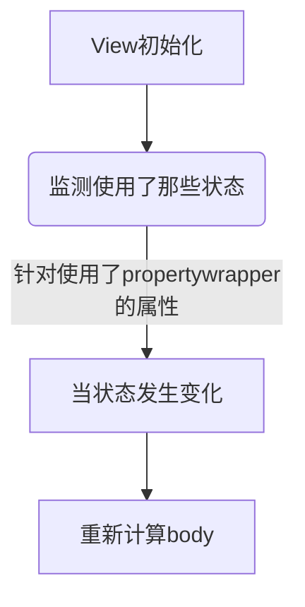

在WWDC2020，SwiftUI再一次进行了重大更新，特别针对引用类型的数据流状态管理，在原有的@ObservedObject基础上，新增了@StateObject这个新的property wrapper，那么两者之间有什么区别？为什么要新增？本篇将通过大量的代码示例，带你进行详细的测试和分析；然后进一步探索@StateObject的内部实现原理，总结各自的使用场景，最后使得读者能够在项目实践中合理使用。


# 淡化生命周期概念

新的SwiftUI与原有的UIKit相对比，一个显著的区别是淡化生命周期（LifeCycle）的概念，原有的ViewController 页面的生命周期非常明确，比如：
* viewDidLoad
* viewWillAppear
* viewWillLayoutSubviews
* viewDidLayoutSubviews
* viewDidAppear
* viewWillDisappear
* viewDidDisappear

这些函数非常明确的给开发者提供了当前ViewController所处的状态信息，而SwiftUI特意淡化LifeCycle的概念，没有ViewController的存在，数据驱动状态，本质上不再需要处理LifeCycle方法，目前可以看到的类似Lifecycle的方法只有`onAppear`和`onDisappear`，同时提供新的事件驱动UI的方式，详细参见官方文档[State and Data Flows](https://developer.apple.com/documentation/swiftui/state-and-data-flow)

SwiftUI以单一数据源机制（single source of truth）为核心，通过新设计的property wrapper，监测数据的变化，以数据驱动状态，一个简单的示意流程图如下所示：


# 关键概念

接下来我们来梳理一下本篇重点分析的几个概念，它们的含义和基本使用方法。

## ObservableObject

> A type of object with a publisher that emits before the object has changed.

* ObservableObject是Combine框架下的**协议类型**，针对引用类型设计，用于在多个View之间共享数据
* 遵循ObservableObject协议的类型，需要实现objectWillChange属性，最简单的实现方式是使用系统提供的@Published，添加到对应需要监听的属性上，这个属性一般不能设置为private，因为可以被外部修改，但如果提供对外方法进行修改，可以改为`private(set)`，即setter方法私有，getter方法默认等级
* 标记为@Published的属性在属性变化前发出变化值，使得对象类型的某个属性的数据改变得以被监听，并发出信号通知View更新
* 属性中添加@Published的**值类型**会在值变化后发出信号，比如struct，如果添加引用类型（嵌套对象）目前会有问题，它的属性变化不会发出信号，需要额外特殊处理（**TODO**）


### objectWillChange
先来看一下ObservableObject协议的定义
```swift
@available(iOS 13.0, macOS 10.15, tvOS 13.0, watchOS 6.0, *)
public protocol ObservableObject : AnyObject {

    /// The type of publisher that emits before the object has changed.
    associatedtype ObjectWillChangePublisher : Publisher = ObservableObjectPublisher where Self.ObjectWillChangePublisher.Failure == Never

    /// A publisher that emits before the object has changed.
    var objectWillChange: Self.ObjectWillChangePublisher { get }
}
```
ObservableObject协议有一个名称为objectWillChange的publisher，他有几个特点：
* 这个publisher不发送数据
* 这个publisher不会失败，即Failure是Never
* 这个publisher只是发通知，Notification的作用
* objectWillChange的类型是ObjectWillChangePublisher

同时在ObservableObject协议的扩展中，系统默认已经实现了objectWillChange
```swift
@available(iOS 13.0, macOS 10.15, tvOS 13.0, watchOS 6.0, *)
extension ObservableObject where Self.ObjectWillChangePublisher == ObservableObjectPublisher {

    /// A publisher that emits before the object has changed.
    public var objectWillChange: ObservableObjectPublisher { get }
}
```

继续来看一下ObservableObjectPublisher类型，遵循Publisher协议
```swift
/// A publisher that publishes changes from observable objects.
@available(iOS 13.0, macOS 10.15, tvOS 13.0, watchOS 6.0, *)
final public class ObservableObjectPublisher : Publisher {

    /// The kind of values published by this publisher.
    public typealias Output = Void

    /// The kind of errors this publisher might publish.
    ///
    /// Use `Never` if this `Publisher` does not publish errors.
    public typealias Failure = Never

    /// Creates an observable object publisher instance.
    public init()

    /// Attaches the specified subscriber to this publisher.
    ///
    /// Implementations of ``Publisher`` must implement this method.
    ///
    /// The provided implementation of ``Publisher/subscribe(_:)-4u8kn``calls this method.
    ///
    /// - Parameter subscriber: The subscriber to attach to this ``Publisher``, after which it can receive values.
    final public func receive<S>(subscriber: S) where S : Subscriber, S.Failure == ObservableObjectPublisher.Failure, S.Input == ObservableObjectPublisher.Output

    final public func send()
}
```
Publisher是Combine框架的组成部分，用于发出信号

### objectWillChange的使用场景

一般来说，如果一个class对象，遵循ObservableObject协议，并且每个属性添加@Published，就可以监听数据变化，刷新UI，是不需要使用bjectWillChange的。

只有在某些特殊场景下，需要修改对象其中的某个属性，然后会进行一系列相关操作，比如保存数据库，条件过滤等，然后才需要发出通知更新UI，此时使用objectWillChange.send使得SwiftUI手动刷新UI，而不使用@Published，能更好的满足需求。

**示例1:**
```swift
class UserAuthentication: ObservableObject {
    let objectWillChange = ObservableObjectPublisher()  //可选

    var username = "" {
        willSet {
            //保存到UerDefault中
            //条件过滤
            //.......
            objectWillChange.send()
        }
    }
}

struct ContentView: View {
    @StateObject var settings = UserAuthentication()

    var body: some View {
        VStack {
            TextField("Username", text: $settings.username)
                .textFieldStyle(RoundedBorderTextFieldStyle())

            Text("Your username is: \(settings.username)")
        }
    }
}
```
简要解释如下：
* UserAuthentication引用类型遵循ObservableObject协议，手动实现了objectWillChange，这里主要是演示，实际使用时可以不用实现，系统有默认的objectWillChange
* 增加username属性的willSet属性观察器，以便我们可以在该值发生更改时运行代码。在我们的示例代码中，只要用户名发生更改，我们就调用objectWillChange.send()，这将告诉objectWillChange发布者发布我们的数据发生更改的消息，以便任何订阅的视图都可以刷新。
* 在ContentView中，创建了UserAuthentication类对象settings，同时使用@StateObject进行修饰；由于UserAuthentication遵循ObservableObject，我们可以像使用任何其他@ObservedObject属性一样使用它。所以，我们可以像这样使用它来显示用户输入时的输入


### @Published的作用

@Published属性包装器的作用就是用来替代手动调用`objectWillChange.send()`，其内部实现很可能就是在其wrappedValue的set方法中通过某种方式调用了objectWillChange.send()`；

## @ObservedObject
> **A property wrapper type** that subscribes to an observable object and invalidates a view whenever the observable object changes.

* 只是作为View的数据依赖，不被View持有，View更新时ObservedObject对象可能会被销毁
* 适合数据在SwiftUI外部存储，把@ObservedObject包裹的数据作为视图的依赖，比如数据库中存储的数据

### ObservedObject定义
我们来具体看一下ObservedObject这个propertyWrapper的代码定义：
```swift
@propertyWrapper @frozen public struct ObservedObject<ObjectType> : DynamicProperty where ObjectType : ObservableObject {

    /// A wrapper of the underlying observable object that can create bindings to
    /// its properties using dynamic member lookup.
    @dynamicMemberLookup @frozen public struct Wrapper {

        /// Returns a binding to the resulting value of a given key path.
        ///
        /// - Parameter keyPath  : A key path to a specific resulting value.
        ///
        /// - Returns: A new binding.
        public subscript<Subject>(dynamicMember keyPath: ReferenceWritableKeyPath<ObjectType, Subject>) -> Binding<Subject> { get }
    }

    /// Creates an observed object with an initial value.
    ///
    /// - Parameter initialValue: An initial value.
    public init(initialValue: ObjectType)

    /// Creates an observed object with an initial wrapped value.
    ///
    /// You don't call this initializer directly. Instead, declare a property
    /// with the `@ObservedObject` attribute, and provide an initial value.
    ///
    /// - Parameter wrappedValue: An initial value.
    public init(wrappedValue: ObjectType)

    /// The underlying value referenced by the observed object.
    ///
    /// This property provides primary access to the value's data. However, you
    /// don't access `wrappedValue` directly. Instead, you use the property
    /// variable created with the `@ObservedObject` attribute.
    ///
    /// When a mutable value changes, the new value is immediately available.
    /// However, a view displaying the value is updated asynchronously and may
    /// not show the new value immediately.
    public var wrappedValue: ObjectType

    /// A projection of the observed object that creates bindings to its
    /// properties using dynamic member lookup.
    ///
    /// Use the projected value to pass a binding value down a view hierarchy.
    /// To get the `projectedValue`, prefix the property variable with `$`.
    public var projectedValue: ObservedObject<ObjectType>.Wrapper { get }
}
```
它主要由三部分组成：

* ObservedObject内部的范型参数ObjectType，必须满足类型是ObservableObject协议类型，也就是说@ObservedObject这个propertyWrapper一定是要跟遵循ObservableObject协议的类型一起使用；
* ObservedObject内部定义了一个Wrapper结构体，实现了subscript下标函数，参数keyPath需要是`ReferenceWritableKeyPath<ObjectType, Subject>`，也就是遵循ObservableObject协议的对象的属性；
* 常规实现一个propertyWrapper所需的`wrappedValue`和投影属性`projectedValue`

**示例2:**

```swift
final class PodcastPlayer: ObservableObject {
    @Published private(set) var isPlaying: Bool = false  //private(set)，setter方法私有，getter方法默认等级

    func play() {
        isPlaying = true
    }

    func pause() {
        isPlaying = false
    }
}

struct EpisodesView: View {
    @ObservedObject var player: PodcastPlayer
    var body: some View {
        List {
            Button(
                action: {
                    if self.player.isPlaying {
                        self.player.pause()
                    } else {
                        self.player.play()
                    }
            }, label: {
                    Text(player.isPlaying ? "Pause": "Play")
                }
            )
        }
    }
}
```

这个实例中，定义了一个音乐播放器PodcastPlayer，遵循ObservableObject；isPlaying是布尔属性，标记是否播放的状态，同时添加了@Published，当数据变化时发出信号刷新UI，需要注意的是这个属性增加了private(set)，表明对外setter方法是不可见的，只有getter方法对外可见，只能在当前类内部设置isPlaying；

在EpisodesView中，增加player属性，使用@ObservedObject修饰，表明当页面被销毁后，player数据也会清除。

## @StateObject

> A property wrapper type that instantiates an observable object.

* 针对引用类型设计，当View更新时，实例不会被销毁，与State类似，使得View本身拥有数据
* @StateObject 和 @ObservedObject 的区别就是实例是否被创建其的View所持有，其生命周期是否完全可控。
* StateObject行为类似ObservedObject对象，区别是StateObject由SwiftUI负责针对一个指定的View，创建和管理一个实例对象，不管多少次View更新，都能够使用本地对象数据而不丢失

虽然SwiftUI不会在视图中重新创建状态对象，但它会为每个视图实例创建一个不同的对象实例。例如，下面代码中的每个LibraryView都有一个唯一的Book实例:
**示例3:**
```swift
struct LibraryView: View {
    @StateObject var book = Book()
    
    var body: some View {
        BookView(book: book)
    }
}

VStack {
    LibraryView()
    LibraryView()
}
```
两个book对象之间的完全独立，互不影响的

### StateObject定义

```swift
@frozen @propertyWrapper public struct StateObject<ObjectType> : DynamicProperty where ObjectType : ObservableObject {

    /// Creates a new state object with an initial wrapped value.
    ///
    /// You don’t call this initializer directly. Instead, declare a property
    /// with the `@StateObject` attribute in a ``SwiftUI/View``,
    /// ``SwiftUI/App``, or ``SwiftUI/Scene``, and provide an initial value:
    ///
    ///     struct MyView: View {
    ///         @StateObject var model = DataModel()
    ///
    ///         // ...
    ///     }
    ///
    /// SwiftUI creates only one instance of the state object for each
    /// container instance that you declare. In the code above, SwiftUI
    /// creates `model` only the first time it initializes a particular instance
    /// of `MyView`. On the other hand, each different instance of `MyView`
    /// receives a distinct copy of the data model.
    ///
    /// - Parameter thunk: An initial value for the state object.
    @inlinable public init(wrappedValue thunk: @autoclosure @escaping () -> ObjectType)

    /// The underlying value referenced by the state object.
    ///
    /// The wrapped value property provides primary access to the value's data.
    /// However, you don't access `wrappedValue` directly. Instead, use the
    /// property variable created with the `@StateObject` attribute:
    ///
    ///     @StateObject var contact = Contact()
    ///
    ///     var body: some View {
    ///         Text(contact.name) // Accesses contact's wrapped value.
    ///     }
    ///
    /// When you change a property of the wrapped value, you can access the new
    /// value immediately. However, SwiftUI updates views displaying the value
    /// asynchronously, so the user interface might not update immediately.
    public var wrappedValue: ObjectType { get }

    /// A projection of the state object that creates bindings to its
    /// properties.
    ///
    /// Use the projected value to pass a binding value down a view hierarchy.
    /// To get the projected value, prefix the property variable with `$`. For
    /// example, you can get a binding to a model's `isEnabled` Boolean so that
    /// a ``SwiftUI/Toggle`` view can control the value:
    ///
    ///     struct MyView: View {
    ///         @StateObject var model = DataModel()
    ///
    ///         var body: some View {
    ///             Toggle("Enabled", isOn: $model.isEnabled)
    ///         }
    ///     }
    public var projectedValue: ObservedObject<ObjectType>.Wrapper { get }
}
```

如果你粗略的看一下StateObject的定义，可能会感觉跟ObservedObject很相近，下面就来对比一下两者之间的异同；

相同点：
* StateObject这个propertyWrapper也有一个范型参数ObjectType，这个参数遵循ObservableObject协议，这与ObservedObject是完全一致的；
* 两个Object都有相同的投影属性projectedValue，类型都是在ObservedObject中定义的Wrapper；
不同点：
* StateObject中wrappedValue是只读属性，而ObservedObject中wrappedValue是读写属性；
* init方法的不同，StateObject中`init(wrappedValue thunk: @autoclosure @escaping () -> ObjectType)`方法传入参数支持一个闭包，这个闭包的返回类型是遵循ObservableObject协议；ObservedObject中两个init方法都是直接传值；

# @ObservedObject vs @StateObject实例对比

下面将通过具体的代码示例进行分析

## 准备
```swift
//首先定义了一个类对象模型StateObjectClass，遵循ObservableObject
class StateObjectClass:ObservableObject{
    let type:String
    let id:Int
    @Published var count = 0    //
    init(type:String){
        self.type = type
        self.id = Int.random(in: 0...1000)
        print("type:\(type) id:\(id) init")
    }
    deinit {
        print("type:\(type) id:\(id) deinit")
    }
}
//使用不同的propertywrapper修饰相同的StateObjectClass对象
//1，使用StateObject
struct CountViewState:View{
    @StateObject var state = StateObjectClass(type:"StateObject")//1
    var body: some View{
        VStack{
            Text("@StateObject count :\(state.count)")
            Button("+1"){
                state.count += 1
            }
        }
    }
}
//2，使用ObservedObject
struct CountViewObserved:View{
    @ObservedObject var state = StateObjectClass(type:"Observed")//2
    var body: some View{
        VStack{
            Text("@Observed count :\(state.count)")
            Button("+1"){
                state.count += 1
            }
        }
    }
}
```
* StateObjectClass将在其被创建和销毁时通过type 和 id 告知我们它是被那种方法创建的，以及具体哪个实例被销毁了
* 为了明确的进行对比，创建了两个视图的结构完全一致的View，CountViewState和CountViewObserved，它们的唯一区别是状态存储state使用的属性包装器

## Test1-独立使用对比测试

```swift
struct Test1: View {
    @State var count = 0
    var body: some View {
        VStack{
            Text("刷新CounterView计数 :\(count)")
            Button("刷新"){
                count += 1
            }

            CountViewState()
                .padding()

            CountViewObserved()
                .padding()

        }
    }
}
```
在测试1中，当点击CountViewState或CountViewObserved内部的+1按钮时，无论是@StateObject或是@ObservedObject其都表现出一致的状态，两个View都可以正常的显示当前按钮的点击次数

当点击外层刷新按钮时，CountViewState中的数值仍然正常，不过CountViewObserved中的计数值被清零了。查看调试信息，
```swift
type:Observed id:537 init
type:StateObject id:886 init
type:Observed id:873 init
type:Observed id:537 deinit
```
当点击刷新时，CountViewObserved中的实例被重新创建了，并销毁了之前的实例，CountViewObserved视图并没有被重新创建，仅是重新求了body的值

## Test2-页面导航跳转
测试2，创建了一个可跳转的导航列表，跳转到不同的页面
```swift
struct Test2: View {
    @State var count = 0
    var body: some View {
        NavigationView{
            List{
                NavigationLink("@StateObject", destination: CountViewState())
                NavigationLink("@ObservedObject", destination: CountViewObserved())
            }
        }
    }
}
```
测试2中，点击link进入对应的视图后通过点击+1进行计数，然后返回父视图。当再次进入link后，@StateObject对应的视图中计数清零，这是由于返回父视图，再次进入时会重新创建视图，所以会重新创建实例，不过@ObservedObject对应的视图中计数是不清零的。在这个测试中，@ObservedObject创建的实例生命周期长于当前的View。

## Test3-弹起新页面
```swift
struct Test3: View {
    @State private var showStateObjectSheet = false
    @State private var showObservedObjectSheet = false
    var body: some View {
        List{
            Button("Show StateObject Sheet"){
                showStateObjectSheet.toggle()
            }
            .sheet(isPresented: $showStateObjectSheet) {
                CountViewState()
            }
            Button("Show ObservedObject Sheet"){
                showObservedObjectSheet.toggle()
            }
            .sheet(isPresented: $showObservedObjectSheet) {
                CountViewObserved()
            }
        }
    }
}
```
测试3中点击按钮，在sheet中点击+1,当再次进入sheet后，无论是@StateObject还是@ObservedObject对应的View中的计数都被清零。

## 小结

通过前面三个测试的分析，进一步明确了两者之间的区别：@StateObject的声明周期与当前所在View生命周期保持一致，即当View被销毁后，StateObject的数据销毁，当View被刷新时，StateObject的数据会保持；而ObservedObject不被View持有，生命周期不一定与View一致，即数据可能被保持或者销毁；

# @StateObject内部实现探索

## 通过一个实例探索内部实现
```swift
class Student: ObservableObject {
    @Published var name:String = "xiaoming"
    @Published var count:Int = 0
    init() {
        print("Student init")  //1 只走一次
    }
}

struct ContentView: View {
    @StateObject var student = Student()
    
    init() {
        print("init")    //2 数据更新，每次View重新绘制，会走
    }
    var body: some View {
        Button(action: {
            student.count += 1   //3 
        }) {
            VStack{
                Text("name=\(student.name)")
                Text("count=\(student.count)")
                Text("+1")
            }
        }
    }
}
```
在注释1和注释2处，添加断点，观察打印信息

当断点停在2处，打印student

```swift
(lldb) p student
2020-07-07 17:16:31.140496+0800 stateExplorer[76800:4929521] [SwiftUI] Accessing StateObject's object without being installed on a View. This will create a new instance each time.
(stateExplorer.Student) $R0 = 0x00006000034d6340 (_name = Combine.Published<Swift.String> @ 0x00006000034d6350, _count = Combine.Published<Swift.Int> @ 0x00006000034d6368)
(lldb) p student
2020-07-07 17:16:33.305996+0800 stateExplorer[76800:4929521] [SwiftUI] Accessing StateObject's object without being installed on a View. This will create a new instance each time.
(stateExplorer.Student) $R2 = 0x0000600003497b00 (_name = Combine.Published<Swift.String> @ 0x0000600003497b10, _count = Combine.Published<Swift.Int> @ 0x0000600003497b28)
(lldb) 
```

* 你会注意到`Accessing StateObject's object without being installed on a View. This will create a new instance each time.`说明这个存储还没有绑定到视图，因为视图还在创建中，所以StateObject只保留初始值，以备需要。现在，我们可以从技术上访问student属性，但它还不能被正确使用；而存储中它包含的所有内容都是声明中提供的初始值的闭包(wrappedValue)。
* 警告：由于视图还没有安装，SwiftUI警告它不能访问这个属性的实际存储，因为它不知道使用哪个视图的存储。它的回退行为就是调用我们给它的闭包的初始值并返回给我们。我们得到一个有效的student，**但每次都是一个新的**。所以你会发现两次`p student`的结果是不一致的。

继续探索，等待view的body渲染完成，再打印

```swift
(lldb) p student
(stateExplorer.Student) $R6 = 0x00006000034c24c0 (_name = Combine.Published<Swift.String> @ 0x00006000034c24d0, _count = Combine.Published<Swift.Int> @ 0x00006000034c24e8)
(lldb) p student
(stateExplorer.Student) $R8 = 0x00006000034c24c0 (_name = Combine.Published<Swift.String> @ 0x00006000034c24d0, _count = Combine.Published<Swift.Int> @ 0x00006000034c24e8)
```

现在产生了一个实际的存储对象，这个存储对象是由SwiftUI创建并跟View进行绑定的，它使用初始值闭包来填充，所以现在访问student将会是相同实例，而不是之前的每次都创建新实例

用户操作页面产生交互并改变一些其他状态，SwiftUI会再次渲染View，View重新初始化，运行到2处断点，student属性与第一次完全相同，继续执行，当body呈现时，再查看student属性

```swift
(lldb) p student
(stateExplorer.Student) $R10 = 0x00006000034c24c0 (_name = Combine.Published<Swift.String> @ 0x00006000034c24d0, _count = Combine.Published<Swift.Int> @ 0x00006000034c24e8)
```

由于我们在Student中的init方法添加了断点，你会发现View不论重新渲染多少次，它只被调用一次。也就是说，SwiftUI找到了视图的现有存储，所以它返回的Student跟第一次相同的值。

看看wrappedValue的地址:它们是相同的。这表明，无论我们为StateObject传递什么到wrappedValue，在视图的生命周期中，我们总是会得到完全相同的对象。不管第一次呈现视图时那个值是什么，这就是我们会得到的。

我们仍然需要@ObservedObject来表示创建在视图之外的对象。

在实际工程中，最常见的方式是开始时，通过视图的初始化方法传入一个对象，然后当这个对象的值发生变化时，我们要使用新的对象，把它传递它的视图更新；对于@ObservedObject，你会得到预期的结果，视图将总是使用你传入的对象；对于@StateObject，就不是这样了。正如我们在上面看到的，@StateObject属性在视图的生命周期中总是返回相同的对象。没有办法创建不具有此行为的StateObject。

再来看下面一个例子：

```swift
//Counter对象Model
class Counter: ObservableObject {
    @Published var count: Int
    
    init(_ initialCount: Int) {
        self.count = initialCount
    }
    
    func increment() {
        count += 1
    }
    
    func decrement() {
        count -= 1
    }
}
//Counters是父视图，包含两个StateObject，counter1和counter2，count的初始值都是0
struct Counters: View {
    @State var useFirstCounter = true
    @StateObject var counter1 = Counter(0)
    @StateObject var counter2 = Counter(0)
    
    var body: some View {
        VStack {
            Counter1(counter: useFirstCounter ? counter1 : counter2)
            Counter2(counter: useFirstCounter ? counter1 : counter2)
            Button("Switch Counter") {
                useFirstCounter.toggle()
            }
        }
    }
}

//子视图Counter1，从父ViewCounters接受参数传入，其内部counter使用@ObservedObject
struct Counter1: View {
    @ObservedObject var counter: Counter
    
    init(counter: Counter) {
        self.counter = counter
    }
    
    var body: some View {
        HStack {
            Button { counter.decrement() } label: { Image(systemName: "minus.circle") }
            Text("\(counter.count)")
            Button { counter.increment() } label: { Image(systemName: "plus.circle") }
        }
    }
}

//子视图Counter2，从父ViewCounters接受参数传入，其内部counter使用@StateObject，意味着在以后的视图更新中，它会每次都使用相同的实例，
//甚至如果父视图随后传入一个不同的counter，也不会变化。
struct Counter2: View {
    @StateObject var counter: Counter
    
    init(counter: Counter) {
        self._counter = StateObject(wrappedValue: counter)
    }
    
    var body: some View {
        HStack {
            Button { counter.decrement() } label: { Image(systemName: "minus.circle") }
            Text("\(counter.count)")
            Button { counter.increment() } label: { Image(systemName: "plus.circle") }
        }
    }
}

```
数据模型Counter是遵循ObservableObject的类型，有一个Int类型count属性可以增减；还有两个不同版本的包含Counter的视图；两个版本都从父视图中获取一个计数器，但一个使用@ObservedObject，一个使用@StateObject。
父视图中有一个按钮，用于选择两个计数器实例中的哪一个传递给子视图。最初，它们都使用相同的实例:当递增或递减一个计数器时，它们都进行更新。但是如果您按下按钮来切换计数器，实际上只有使用@ObservedObject的计数器会改变。@StateObject继续使用第一次创建时传递的计数器。


## StateObject两种初始化方式
* 定义时直接赋初值
```swift
@StateObject var counter: Counter = Counter（） //1
```
* 通过Property wrapper的init方法赋值

```swift
    @StateObject var counter: Counter
    
    init(counter: Counter) {
        self._counter = StateObject(wrappedValue: counter)  //2
       //self.counter = counter   //3
    }
```
注释2处是正确方式，注释3处是错误的，提示Cannot assign to property: 'counter' is a get-only property

那么第二种通过wrappedValue进行初始化的方式什么时候需要使用呢？这与你希望为状态设置初始值的原因是相同的:如果你特别希望根据视图的参数设置初始值，然后让视图从那里管理状态，你就需要这种方式。

我们来举一个具体例子：在我的应用中，有一个搜索字段，最初是空的。当用户键入时，它会更新一些状态，但我不想在每次更改时立即获取新数据。相反，我只想在他们停止输入一段时间后获取结果。为此，我在代码中添加了两个记录输入结果的String内容inputText和query，但是它们有不同的作用；

```swift
class SearchDelayer: ObservableObject {
    //用户每次输入内容都会更新inputText
    @Published var inputText: String
    
    //查询输入结果，当用户输入后，延时500毫秒后赋值给当前参数，这期间可能发生多次变化，但是只会把最终的值赋给query
    @Published var query: String
    init(text: String) {
        inputText = text
        query = text
        $inputText
            .debounce(for: .milliseconds(500), scheduler: DispatchQueue.main)
            .assign(to: $query)
    }
}
```

SearchDelayer应该属于我的搜索屏幕视图，所以使用StateObject是有意义的。由于搜索字段一开始是空的，我可以这样声明:
```swift
struct GameSearchScreen: View {
  @StateObject private var searchDelayer = SearchDelayer(text: "")
}
```

但当我想为视图添加预览时，这就不一样了还是使用`SearchDelayer(text: "")`就不能满足需求。我想能够预览Preview那里的搜索查询已经填写，所以我传递初始查询到GameSearchScreen和填充searchDelayer字段的初始值:
```swift
struct GameSearchScreen: View {
  @StateObject private var searchDelayer: SearchDelayer
  init(initialQuery: String = "") {
      _searchDelayer = StateObject(wrappedValue: SearchDelayer(text: initialQuery))
  }
  
  // ...
}
```

现在我可以创建一个具有特定初始值的GameSearchScreen。GameSearchScreen仍然拥有这里的状态:如果父视图稍后传入一个新的initialQuery值，它实际上不会影响任何东西，这正是我想要的。

## 小结

* 如果视图没有被销毁，则其内部的@StateObject也不会被销毁，此时外部传入参数修改@StateObject包装的参数将不会成功，而是保留之前的值
* 如果视图被销毁，由于@StateObject与视图生命周期一致，则再次创建视图，将会使用默认的初始值，不会保留历史结果

# 总结
* @ObservedObject表明了你的视图想要观察某种符合ObservableObject协议的引用类型。它的唯一目的是告诉SwiftUI，当观察到的对象发生变化时，你需要更新视图。
* @StateObject也这样做，但是非常重要的区别是，它还控制@ObservedObject的生命周期。这意味着只有在适当的时候才会实例化和销毁标记为@StateObject的属性。@StateObject属性不会在每次包含它们的视图结构进入和离开作用域时被销毁和重新实例化(就像@State)。相比之下，@ObservedObject没有这样的保证，@ObservedObject类似@Binding。
* 你可以在声明实例本身的视图中直接使用@StateObject创建的实例，或者在@ObservedObject属性中沿层次结构传递实例。

# 参考

*  https://onevcat.com/2020/06/stateobject/
*  https://developer.apple.com/documentation/swiftui/state-and-data-flow
*  https://developer.apple.com/documentation/swiftui/managing-model-data-in-your-app
*  https://www.mattmoriarity.com/2020-07-03-stateobject-and-observableobject-in-swiftui/
*  https://developer.apple.com/documentation/swiftui/managing-model-data-in-your-app