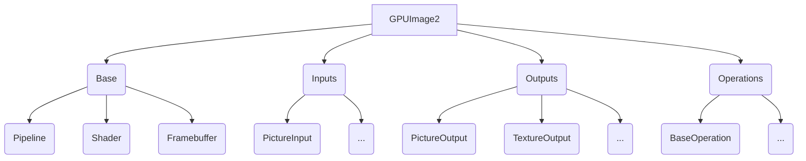

`GPUImage`是知名的图像处理开源框架，本篇文章以Swift版本的[GPUImage2](https://github.com/BradLarson/GPUImage2)为分析对象，以`GPUImage`中`Pipeline`的处理流程为线索，分析其核心的实现流程设计理念，使得我们不但能够理解其核心原理，也能够从中获得有益的经验，运用到自己的编程设计中。

# 引言

`GPUImage`可以进行多种模式的图像处理，其逻辑类似于流水线的概念。流水线上有若干个工位（`Target`），每个工位接收来自上一个工位的产品（`Data`），完成此工序的加工（`Operation`）后交给下一个工位（`Target`）处理。产品从开始端（`Input`）经过整条流水线加工，到达结束端（`Output`）变为成品。

# 目录结构

先来看一下这张目录结构图，我们重点关注处理静态图片相关的部分，其他的部分暂时忽略。


# `-->`运算符

我们以一个常见的静态图片处理流程为例，展开介绍：
```swift
picture = PictureInput(image:UIImage(named:"WID-small.jpg")!)
filter = SaturationAdjustment()
picture --> filter --> renderView
picture.processImage()
```
利用`GPUImage`我们可以方便的进行上面链式操作，把一张图片作为输入源，后续的纹理处理流程通过`-->`串联起来，直到最后的输出结果；`-->`是`GPUImage`定义的一个中缀运算符，它将两个或多个对象像链条一样串联起来；

左边的参数遵循`ImageSource`协议，作为数据的输入，右边的参数遵循`ImageConsumer`协议，作为数据的输出。这里的filter是`BasicOperation`的一个实例，其父类`ImageProcessingOperation`同时遵循`ImageSource`和`ImageConsumer`协议，所以它可以放在`-->`的左边或右边。

接下来看一下`-->`的具体代码实现；

```swift
infix operator --> : AdditionPrecedence
//precedencegroup ProcessingOperationPrecedence {
//    associativity: left
////    higherThan: Multiplicative
//}
@discardableResult public func --><T:ImageConsumer>(source:ImageSource, destination:T) -> T {
    source.addTarget(destination)
    return destination
}
```

`-->`的运算是左结合的，`GPUImage`中内部实现了`addTarget`方法，并且`-->`有一个返回值，就是右边的参数。在上面的示例中，先计算了前半部`picture --> filter`，然后右边的参数`filter`作为返回值又参与了后半部`filter --> renderView`的计算。

`-->`体现了链式编程的思想，让代码更加优雅，在`GPUImage2`有着大量运用。

# Pipeline内部关系

为了进一步理解`ImageSource`协议和`ImageConsumer`协议，我们首先来了解一下`Pipeline`的内部逻辑关系。


* `ImageProcessingOperation`协议同时继承`ImageSource`协议和`ImageConsumer`协议
* `ImageSource`协议中定义的targets类型是`TargetContainer`
* `ImageConsumer`协议中定义的sources类型是`SourceContainer`

## TargetContainer

`TargetContainer`是`ImageSource`协议中定义的`targets`参数的类型，它遵循`Sequence`协议，用来存储下一步需要的Target对象，帮助建立链式的调用关系。

首先简单回顾一下`Sequence`协议：

* Sequence协议

```swift
protocol Sequence {
   associatedtype Iterator
   func makeIterator() -> Iterator
}
protocol IteratorProtocol {
   associatedtype Element
   mutating func next() -> Element?
}
```
遍历器`Iterator`遵循`IteratorProtocol`协议，协议有一个mutating的next方法，这个方法返回`Sequence`中下一个对象，直到没有，返回nil；在实际使用过程中，我们经常使用`AnySequence`，简化整个过程，`AnySequence`遵循`Sequence`协议，是一个类型擦除的`Sequence`，类比oc的id类型，然后其中创建`AnyIterator`；`AnyIterator`是`AnySequence`的实例，将其操作转发给具有相同元素类型的底层基序列，从而隐藏底层序列的细节。 实质是传入一个生成下一个元素的闭包，内部通过next方法往后遍历下一个Element元素类型。

* `TargetContainer`遵循`Sequence`协议，内部有targets属性，类型是`WeakImageConsumer`，即弱引用`ImageConsumer`类型
```swift
public func makeIterator() -> AnyIterator<(ImageConsumer, UInt)> {
        var index = 0
        
        return AnyIterator { () -> (ImageConsumer, UInt)? in
            return self.dispatchQueue.sync{
                if (index >= self.targets.count) {
                    return nil
                }
                //为什么不是if？
                while (self.targets[index].value == nil) {
                    self.targets.remove(at:index)
                    if (index >= self.targets.count) {
                        return nil
                    }
                }
                
                index += 1
                return (self.targets[index - 1].value!, self.targets[index - 1].indexAtTarget)
           }
        }
    }
```

`makeIterator()`内部实现了遍历targets的流程，这里需要特别注意其中的while循环的设计，其目的是找到value值为nil的元素，然后从数组中移除，那么请问为什么不使用if，而要用while？这是因为要一次移除targets所有value为nil的，targets是数组，0如果为nil，移除后，原来的第一个元素就移动到位置0，如果是if，则会错过，下次判断的是`index += 1`的值。

此外，函数结尾的返回值从`index - 1`开始，因为上一步`index += 1`，为了后续进行下一次遍历数组输出，其实也可以换成下面这种方式：
```swift
defer {
     index += 1
}
return (self.targets[index].value!, self.targets[index].indexAtTarget)
```
可读性会更好。                

## SourceContainer

继续了解一下`ImageConsumer`协议中sources对象的类型`SourceContainer`

* 内部缓存字典sources，存储key和对应的ImageSource
* 内部包含add，remove，insert方法，管理字典

# FrameBuffer

从`-->`运算符的内部实现可以得知，下一步是执行`ImageSource`的扩展函数`addTarget`

```swift
    func addTarget(_ target:ImageConsumer, atTargetIndex:UInt? = nil) {
        if let targetIndex = atTargetIndex {
            //target是ImageConsumer类型，即Consumer add source
            target.setSource(self, atIndex:targetIndex)
            //targets是ImageSource类型，即Source增加consumer并指定位置
            targets.append(target, indexAtTarget:targetIndex)
            //遵循ImageSource协议的实现
            transmitPreviousImage(to:target, atIndex:targetIndex)
        } else if let indexAtTarget = target.addSource(self) {
            targets.append(target, indexAtTarget:indexAtTarget)
            transmitPreviousImage(to:target, atIndex:indexAtTarget)
        } else {
            debugPrint("Warning: tried to add target beyond target's input capacity")
        }
    }
```
其中，source中添加对应consumer，consumer中添加对应source，然后执行`ImageSource`中定义的`transmitPreviousImage`函数，我们以`PictureInput`和`TextureInput`这两个都遵循`ImageSource`协议对象为例，查看内部对应的实现：

**PictureInput**
```swift
    public func transmitPreviousImage(to target:ImageConsumer, atIndex:UInt) {
        if hasProcessedImage {
            imageFramebuffer.lock()
            target.newFramebufferAvailable(imageFramebuffer, fromSourceIndex:atIndex)
        }
    }
```
**TextureInput**
```swift
    public func transmitPreviousImage(to target:ImageConsumer, atIndex:UInt) {
        textureFramebuffer.lock()
        target.newFramebufferAvailable(textureFramebuffer, fromSourceIndex:atIndex)
    }
```
都会调用`target.newFramebufferAvailable`，唯一的不同是传入的不同的framebuffer，但是他们的类型都是`Framebuffer`

## Framebuffer


`Framebuffer`是`GPUImage`对OpenGL ES的 frameBuffer 封装，负责处理帧缓冲区里面的操作，生成顶点坐标数据，将顶点数据从 CPU 拷贝到 GPU 的显存中，并且生成纹理，设置纹理的放大缩小过滤方式`（GL_TEXTURE_MIN_FILTER，GL_TEXTURE_MAG_FILTER）`以及环绕方式`（GL_TEXTURE_WRAP_S，GL_TEXTURE_WRAP_T）`，如果使用 mipmap，还需要处理 mipmap 相关设置。默认不使用 mipmap。

## FramebufferCache


`FramebufferCache`是GPUImageFrameBuffer的管理类,使用Dictionary缓存FrameBuffer，对改善整个框架的内存使用量非重要。

GPUImage建立在链式操作的离散的过滤器(Filter)基础上，链式管道上的每个过滤器都包含着自己的着色器和帧缓冲区，着色器将其输出结果放到帧缓冲区；但是这样操作会有非常明显的内存报警风险，假设每个过滤器都有至少一个纹理图像，这些图像纹理都是未压缩的位图（内存占用=width * height * 4），对于一个普通的1080p的视频其一帧的内存占用就会达到8M，当在链式管道上包含多个过滤器时，很快就会出现内存使用量激增，甚至达到最大峰值，使得程序崩溃。

`FramebufferCache`的内部设计机制，类似于iOS系统的UITableview的Cell复用机制，其工作方式是，当过滤器想要绘制帧时，它会向`FramebufferCache`缓存询问是否具有所需大小和纹理特征的帧缓冲区。如果`FramebufferCache`缓存中不存在一个，则创建一个新的并返回。如果确实存在，则将其从缓存中取出并交给过滤器。

过滤器运行其处理操作，然后将其帧缓冲区交给过滤器管道链中的下一步。随后的过滤器做同样的事情，为它的输出请求一个帧缓冲区，一旦它不再需要上一步的帧缓冲区，它就会释放它。`FramebufferCache`中使用引用计数系统来跟踪何时不再需要帧缓冲区，一旦不需要，它们就会被放回到帧缓冲区缓存中。

来看具体的函数：

* `requestFramebufferWithProperties`获取Framebuffer帧缓冲区

1. 计算hash值，用于放入缓存字典framebufferCache作为key，类型是 `[Int64:[Framebuffer]]()`，即值是数组
2. 如果当前key对应的数组中Framebuffer数量大于1个，则取出最后一个，即恢复之前的
3. 否则，创建新的Framebuffer，并把cache设置为FramebufferCache本身

* 处理引用计数的代码，包含lock()和unlock()两个匹配对应函数，lock()使得引用计数加1，unlock()使得引用计数减1，当引用计数为0，则把当前使用的帧缓冲区放回`FramebufferCache`
```swift
    weak var cache:FramebufferCache?
    var framebufferRetainCount = 0
    public func lock() {
        framebufferRetainCount += 1
    }

    func resetRetainCount() {
        framebufferRetainCount = 0
    }
    
    public func unlock() {
        framebufferRetainCount -= 1
        if (framebufferRetainCount < 1) {
            if ((framebufferRetainCount < 0) && (cache != nil)) {
                print("WARNING: Tried to overrelease a framebuffer")
            }
            framebufferRetainCount = 0
            cache?.returnToCache(self)
        }
    }
```

* `returnToCache`：当`Framebuffer`引用计数归零时，放回`FramebufferCache`字典里。

```swift
    func returnToCache(_ framebuffer:Framebuffer) {
//        print("Returning to cache: \(framebuffer)")
        context.runOperationSynchronously{
            if (self.framebufferCache[framebuffer.hash] != nil) {
                self.framebufferCache[framebuffer.hash]!.append(framebuffer)
            } else {
                self.framebufferCache[framebuffer.hash] = [framebuffer]
            }
        }
    }
```

## 创建OpenGL framebuffer

在`Framebuffer`中真正创建创建OpenGL framebuffer，调用OpenGL ES的API的代码位于`OpenGLRendering`和`RenderView-UIKit`中，主要涉及下面两个函数，体现两种不同的使用方式：

* createDisplayFramebuffer **创建带renderbuffer的framebuffer**

```swift
func createDisplayFramebuffer() {
        var newDisplayFramebuffer:GLuint = 0
        glGenFramebuffers(1, &newDisplayFramebuffer)
        displayFramebuffer = newDisplayFramebuffer
        glBindFramebuffer(GLenum(GL_FRAMEBUFFER), displayFramebuffer!)

        var newDisplayRenderbuffer:GLuint = 0
        glGenRenderbuffers(1, &newDisplayRenderbuffer)
        displayRenderbuffer = newDisplayRenderbuffer
        glBindRenderbuffer(GLenum(GL_RENDERBUFFER), displayRenderbuffer!)

        sharedImageProcessingContext.context.renderbufferStorage(Int(GL_RENDERBUFFER), from:self.layer as! CAEAGLLayer)

        var backingWidth:GLint = 0
        var backingHeight:GLint = 0
        glGetRenderbufferParameteriv(GLenum(GL_RENDERBUFFER), GLenum(GL_RENDERBUFFER_WIDTH), &backingWidth)
        glGetRenderbufferParameteriv(GLenum(GL_RENDERBUFFER), GLenum(GL_RENDERBUFFER_HEIGHT), &backingHeight)
        backingSize = GLSize(width:backingWidth, height:backingHeight)
        
        guard ((backingWidth > 0) && (backingHeight > 0)) else {
            fatalError("View had a zero size")
        }

        glFramebufferRenderbuffer(GLenum(GL_FRAMEBUFFER), GLenum(GL_COLOR_ATTACHMENT0), GLenum(GL_RENDERBUFFER), displayRenderbuffer!)
        
        let status = glCheckFramebufferStatus(GLenum(GL_FRAMEBUFFER))
        if (status != GLenum(GL_FRAMEBUFFER_COMPLETE)) {
            fatalError("Display framebuffer creation failed with error: \(FramebufferCreationError(errorCode:status))")
        }
}
```
如函数名所示，这个函数创建的OpenGL framebuffer是用来在屏幕上展示的，framebuffer本身不绑定任何内容是不能工作的，所以必须绑定renderbuffer或者texture，这里是用于屏幕显示所以绑定renderbuffer


* generateFramebufferForTexture **创建带纹理的framebuffer**

```swift
func generateFramebufferForTexture(_ texture:GLuint, width:GLint, height:GLint, internalFormat:Int32, format:Int32, type:Int32, stencil:Bool) throws -> (GLuint, GLuint?) {
    var framebuffer:GLuint = 0
    glActiveTexture(GLenum(GL_TEXTURE1))

    glGenFramebuffers(1, &framebuffer)
    glBindFramebuffer(GLenum(GL_FRAMEBUFFER), framebuffer)
    glBindTexture(GLenum(GL_TEXTURE_2D), texture)
    
    glTexImage2D(GLenum(GL_TEXTURE_2D), 0, internalFormat, width, height, 0, GLenum(format), GLenum(type), nil)  //重要，数据是空
    glFramebufferTexture2D(GLenum(GL_FRAMEBUFFER), GLenum(GL_COLOR_ATTACHMENT0), GLenum(GL_TEXTURE_2D), texture, 0)  //Framebuffer绑定Texture

    let status = glCheckFramebufferStatus(GLenum(GL_FRAMEBUFFER))
    if (status != GLenum(GL_FRAMEBUFFER_COMPLETE)) {
        throw FramebufferCreationError(errorCode:status)
    }
    
    let stencilBuffer:GLuint?
    if stencil {
        stencilBuffer = try attachStencilBuffer(width:width, height:height)
    } else {
        stencilBuffer = nil
    }
    
    glBindTexture(GLenum(GL_TEXTURE_2D), 0)
    glBindFramebuffer(GLenum(GL_FRAMEBUFFER), 0)
    return (framebuffer, stencilBuffer)
}
```

这个函数创建的OpenGL framebuffer是用来在进行纹理填充的，生成的framebuffer挂载的是一个`GL_TEXTURE_2D`,而不是一个`GL_RENDERBUFFER`，我们用这个挂载着`GL_TEXTURE_2D`的framerBuffer来渲染图片的话，整个GPU渲染流程的结果并不是到了屏幕上，而是放到texture指定的空纹理中，注意
```swift
glTexImage2D(GLenum(GL_TEXTURE_2D), 0, internalFormat, width, height, 0, GLenum(format), GLenum(type), nil) 
```
其中，**最后一个参数是nil，这说明我们只是填充了一个空纹理，里面并没有填充任何数据，这种绑定空纹理的方式，使得GPU管线的处理结果最终到这个空的纹理中，由于这个纹理id是我们自己声明的，所以可以顺利拿到这个结果。这是后续理解`GPUImage`中Pipeline管线传输纹理数据的核心！**

# SerialDispatch

```swift
public protocol SerialDispatch {
    var serialDispatchQueue:DispatchQueue { get }
    var dispatchQueueKey:DispatchSpecificKey<Int> { get }
    func makeCurrentContext()
}
```

由于每个线程都会维护一个不同的上下文Context，而我们在使用时，需要持续使用唯一的上下文Context进行状态管理，所以`SerialDispatch`协议设计被用于保证Context唯一性，必要时切换线程。

保证Context唯一性的方式是使用`DispatchQueue.setSpecific/getSpecific`；

## 主线程与主队列

进程是拥有资源的最小单位。线程是执行的最小单位。

* 主线程是进程创建的第一个线程，其他线程是依赖第一个线程而创建，但是他们一旦创建了，CPU在调度的时候是平等。主线程通常又叫UI线程。为什么和UI相关的东西都要放在主线程中执行？因为在UIApplication初始化的时候在主线程中启动一个Runloop，子线程默认是没有的。

* 队列像栈一样，是一种线性表，它的特性是先进先出，插入在一端，删除在另一端。`DispatchQueue.main`主队列的获取是通过类变量获取的，这说明主队列是事先分配好的。

## 队列和线程之间关系

线程就是线程，队列就是队列，这两者概念上应该是清晰的，**只不过队列是运行在线程上的**；主队列运行在主线程中，它只是被默认取了个名字叫 main 真实的名字叫做 `com.apple.main-thread`。

```swift
func doSomeThingInCommonQueue(){
        let queue = DispatchQueue.init(label: "aaa");
        queue.sync {
            print("queue run in \(Thread.current)");
            self.imageView.image = UIImage(named: "image1.png");
        }
    }
```
启动一个队列使用同步方式，它运行的线程是主线程，并且界面刷新正常。
```
queue run in <NSThread: 0x28233edc0>{number = 1, name = main
```
**队列是平等的，自定义的队列在主线程中运行也能起到主队列的作用，主队列只不过是一种约定俗成的概念，默认将系统帮我们建立的这个取名为main的队列叫做主队列**

## 只有主队列运行可以运行在主线程上吗？？

**我们可以通过`Thread.isMainThread`判断是否在主线程，GCD没有提供API来进行判断当前执行任务是在什么队列。但是我们可以利用dispatch_queue_set_specific和 dispatch_get_specific这一组方法为主队列打上标记，这里是RxSwift判断是否是主队列的代码：**

```swift
extension DispatchQueue {
    private static var token: DispatchSpecificKey<()> = {
        let key = DispatchSpecificKey<()>()
        DispatchQueue.main.setSpecific(key: key, value: ())
        return key
    }()

    static var isMain: Bool {
        return DispatchQueue.getSpecific(key: token) != nil
    }
}
```

进一步看下面几个例子：

```swift
    func test_global_sync() {
        let key = DispatchSpecificKey<String>()

        DispatchQueue.main.setSpecific(key: key, value: "main")

        func log() {
            debugPrint("main thread: \(Thread.isMainThread)")
            let value = DispatchQueue.getSpecific(key: key)
            debugPrint("main queue: \(value != nil)")
        }

        DispatchQueue.global().sync(execute: log)
    }
    
    
/*
 "main thread: true"
 "main queue: false"
*/
```

`DispatchQueue.global().sync`在主线程中执行任务，只是`DispatchQueue.global().sync`会在主线程执行，注意是sync，`DispatchQueue.global().async`就不在主线程执行


```swift
    func test_main_aysnc() {
        let key = DispatchSpecificKey<String>()

        DispatchQueue.main.setSpecific(key: key, value: "main")

        func log() {
          debugPrint("main thread: \(Thread.isMainThread)")
          let value = DispatchQueue.getSpecific(key: key)
          debugPrint("main queue: \(value != nil)")
        }

        DispatchQueue.global().async {
          DispatchQueue.main.async(execute: log)
        }
//        dispatchMain()
    }
    
 /*
"main thread: true"
"main queue: true"
 */   
```

主队列一定在主线程执行

```swift
    func test_global_async() {
        let key = DispatchSpecificKey<String>()
        
        DispatchQueue.main.setSpecific(key: key, value: "main")
        
        func log() {
            debugPrint("main thread: \(Thread.isMainThread)")
            let value = DispatchQueue.getSpecific(key: key)
            debugPrint("main queue: \(value != nil)")
        }
        //异步操作
        DispatchQueue.global().async(execute: log)
    }
    
/*
"main thread: false"
"main queue: false"
*/
```

`DispatchQueue.global().async`在子线程执行

## GPUImage中DispatchSpecificKey具体使用

### get获取
SerialDispatch.swift
```swift
public protocol SerialDispatch {
    var serialDispatchQueue:DispatchQueue { get }
    var dispatchQueueKey:DispatchSpecificKey<Int> { get }
    func makeCurrentContext()
}

    func runOperationSynchronously(_ operation:() -> ()) {
        // TODO: Verify this works as intended
        if (DispatchQueue.getSpecific(key:self.dispatchQueueKey) == 81) {
            operation()
        } else {
            self.serialDispatchQueue.sync {
                self.makeCurrentContext()
                operation()
            }
        }
    }
```

### set设置
OpenGLContext-OpenGLES.swift
```swift
public class OpenGLContext: SerialDispatch {

init() {
    serialDispatchQueue.setSpecific(key:dispatchQueueKey, value:81)
```

# GPUImage中Pipeline核心流程

接下来，我们利用前面已经介绍的知识内容，进一步梳理清楚下面两个问题：

* 链式调用关系的建立和调用过程
* 如何进行纹理参数的传递

## 链式调用过程

下面这个例子在文章开头例子的基础上稍作修改，有两个过滤器，饱和度调整过滤器和亮度过滤器；输入的图片，进行两次调整后，输出到屏幕上。
```swift
picture = PictureInput(image:UIImage(named:"WID-small.jpg")!)
filter = SaturationAdjustment()
let luminanceFilter = Luminance()
picture --> filter --> luminanceFilter --> renderView
picture.processImage()//#1
```

其中`SaturationAdjustment`和`Luminance`都是`GPUImage`的内置类型，他们的类型关系如下图所示：

**类关系图**


接下来从输入图片开始，一步步介绍`GPUImage`内部的调用流程：

**调用时序图**


图中分为Source和Consumer两个部分，分别代表遵循`ImageSource`和`ImageConsumer`协议的对象，其中Source和Consumer编号后面的字符串，如Source1:bd56b0代表当前的Source1，它的指针值是bd56b0，这个值仅仅是用于展示Source和Consumer之间的关系。


1. `PictureInput`初始化，图片处理，传入初始化纹理图片与self.imageFramebuffer绑定；
```swift
picture = PictureInput(image:UIImage(named:"WID-small.jpg")!)
```

2. `-->`运算符建立链式操作，链上对象依次执行`addTarget`，内部的`targets.append`是异步操作；然后执行`PictureInput`中`transmitPreviousImage`，其内部由于`hasProcessedImage`为false，不执行；
```swift
    func addTarget(_ target:ImageConsumer, atTargetIndex:UInt? = nil) {
        if let targetIndex = atTargetIndex {
            //Consumer add source
            target.setSource(self, atIndex:targetIndex)
            //targets属于ImageSource，即Source增加consumer并指定位置
            targets.append(target, indexAtTarget:targetIndex)
            //
            transmitPreviousImage(to:target, atIndex:targetIndex)
        } else if let indexAtTarget = target.addSource(self) {
            targets.append(target, indexAtTarget:indexAtTarget)
            transmitPreviousImage(to:target, atIndex:indexAtTarget)
        } else {
            debugPrint("Warning: tried to add target beyond target's input capacity")
        }
    }
```

3. 调用`processImage`函数；执行`PictureInput`中`updateTargetsWithFramebuffer(self.imageFramebuffer)`，即`ImageSource`协议中`updateTargetsWithFramebuffer`，targets是TargetContainer，TargetContainer是Sequence，内部持有targets；
```swift
    public func processImage(synchronously:Bool = false) {
        if synchronously {
            sharedImageProcessingContext.runOperationSynchronously{
                sharedImageProcessingContext.makeCurrentContext()
                self.updateTargetsWithFramebuffer(self.imageFramebuffer) //#2
                self.hasProcessedImage = true
            }
        } else {
            sharedImageProcessingContext.runOperationAsynchronously{
                sharedImageProcessingContext.makeCurrentContext()
                self.updateTargetsWithFramebuffer(self.imageFramebuffer)
                self.hasProcessedImage = true
            }
        }
    }
```

4. 遍历targets，执行对应Consumer的`newFramebufferAvailable`（即`BasicOperation`，遵循`ImageConsumer`协议），传入imageFramebuffer；
```swift
    func updateTargetsWithFramebuffer(_ framebuffer:Framebuffer) {
        if targets.count == 0 { // Deal with the case where no targets are attached by immediately returning framebuffer to cache
            framebuffer.lock()
            framebuffer.unlock()
        } else {
            // Lock first for each output, to guarantee proper ordering on multi-output operations
            for _ in targets {
                framebuffer.lock()
            }
        }
        for (target, index) in targets {
            target.newFramebufferAvailable(framebuffer, fromSourceIndex:index)
        }
    }
```

5. `newFramebufferAvailable`内部，继续执行Source（`BasicOperation`）的`updateTargetsWithFramebuffer`；
```swift
    public func newFramebufferAvailable(_ framebuffer:Framebuffer, fromSourceIndex:UInt) {
        if let previousFramebuffer = inputFramebuffers[fromSourceIndex] {
            previousFramebuffer.unlock()
        }
        inputFramebuffers[fromSourceIndex] = framebuffer

        guard (!activatePassthroughOnNextFrame) else { // Use this to allow a bootstrap of cyclical processing, like with a low pass filter
            activatePassthroughOnNextFrame = false
            updateTargetsWithFramebuffer(framebuffer)
            return
        }
        
        if (UInt(inputFramebuffers.count) >= maximumInputs) {
            renderFrame()
            
            updateTargetsWithFramebuffer(outputFramebuffer)
        }
    }
```

6. 执行Consumer的`newFramebufferAvailable`；
7. 以此类推，上一步的输出（`ImageConsumer`）在下一步成为输入（`ImageSource`）循环执行，直到没有下一步。。。


## 纹理传递

在GPUImage中管道中传输的数据就是帧缓冲和纹理，具体来说创建framebuffer，然后把上一步的framebuffer中纹理的的结果传递给下一个framebuffer使用，所以传递纹理成为理解GPUImage框架的核心问题；

为什么不能通过反复生成图片然后传递纹理来解决这个问题？即我们向shader传递纹理数据通过：
```
UIImage -> texture -> framebuffer -> glReadPixels -> 获取图片
```
只需要在每次shader处理完获取图片然后使用另一个shaderProgram,再次进行这个流程，如此反复，完整路径如下：

```
UIImage -> texture -> framebuffer -> glReadPixels -> 生成图片 -> 更换shader -> 上一个流程获取的UIImage -> texture -> framebuffer -> glReadPixels -> 获取图片
```
但是，这个方法是行不通的。

* 原因1.GLFramebuffer在这里attach的是一个renderbuffer,而renderbuffer的尺寸往往和真实图片无关，而是与显示图片的视图尺寸有直接关系。当你使用glReadPixel去读取GLRenderBuffer里的像素数据的时候，返回的图片大小只能是你GLRenderBuffer的大小。（例如移动端可能最多和你的屏幕尺寸相当）。所以当你使用这种方法处理大图的时候，会发现最后生成的图片是一张小图。

* 原因2： 处理过程涉及到太多的CPU处理环节。我们使用OpenGL ES来处理图片的原因最直接的一个原因是因为，使用GPU处理图片的速度远超CPU。而整个过程除了一些不可避免的预处理，比如CPU向GPU传递纹理数据，uniform类型的值，我们可以使用CPU以外，应该尽量避免使用CPU。那么每当我们在glReadPixels然后再利用CoreGrpaphics来生成图片的时候，我们已经完全的使用了CPU。这必然会极大的拖慢整个处理流程的速度。

所以正确的传递流程是，创建frambuffer时，设置`glTexImage2D`函数最后参数为nil，即绑定空纹理的方式创建framebuffer，使得GPU管线前一步的处理结果放到这个空的纹理中，由于这个纹理id是我们自己声明的，所以可以拿到这个纹理标识符；然后把这个纹理标识符作为uniform参数，输入到后面后续环节的shader里，这样循环往复，不断传递，如下图所示。


# 总结
`GPUImage`框架充分运用了Swift语言的特色：使用`-->`自定义运算符，串联起整个链式流程，隐藏了丰富的实现的细节，使得代码设计十分简洁优雅；Pipeline内部设计多种协议，通过组合协议及继承，构成了链式调用过滤器的基础，使得其中任何一个环节的Target对象，既可以成为上个环节的输出，又是下个环节的输入，十分巧妙；通过设计合理的缓存机制，解决了未压缩图片内存爆增的问题；使用`DispatchQueue.setSpecific/getSpecific`保证Context的唯一性问题。此外，`GPUImage`框架对OpenGL ES相关的API进行了必要的抽象和封装，使得使用者能够更专注于业务功能，忽略底层API的复杂性。

# 参考

* https://developer.apple.com/library/archive/documentation/GraphicsImaging/Conceptual/drawingwithquartz2d/dq_images/dq_images.html
* http://www.sunsetlakesoftware.com/2014/03/17/switching-gpuimage-use-cached-framebuffers
* https://zhuanlan.zhihu.com/p/32695857


