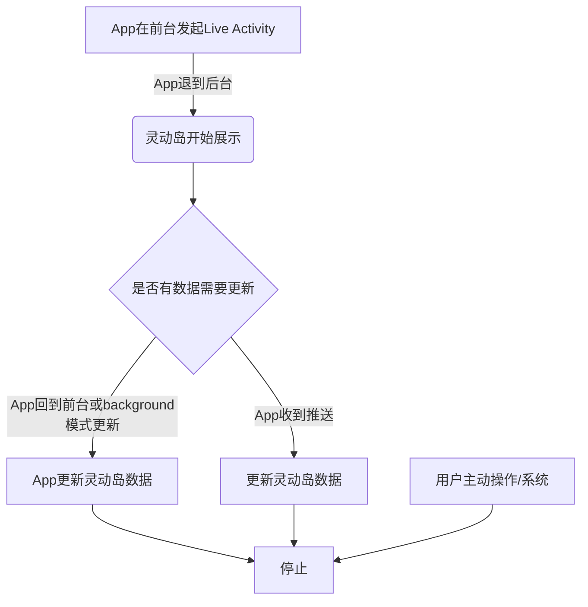

在2022年9月刚刚结束的苹果秋季发布会上，除了常规的手机等硬件设备新品发布，伴随而来一个新的软件功能——灵动岛（Dynamic Island）；灵动岛是将前置镜头和软件通知结合在一起的一个全新功能，2017年发布的iPhone10打电话时候，左上角的那颗胶囊应该就是这个功能的前身，灵动岛上更进一步，不同应用可以展现出不同的样式，本篇文章将从软件开发角度，探索灵动岛的展现形式、功能限制、如何具体实现、适用场景等各方面的问题；帮助还不了解相关信息的开发者快速理解这一新的展现形式，并结合自身产品形态做出创新。

[toc]

# 概览

灵动岛（Dynamic Island）相关API，隶属于Live Activity Framework，出现在iOS16.1系统；Live Activities负责在iPhone锁屏（Lock Screen）和灵动岛（Dynamic Island）中显示应用程序的最新数据。这使得人们一眼就能看到实时信息,并可以进行一些简单交互。

## 元素及展示位置

接下来，我们详细介绍一下能够利用Live Activity，展示UI元素与用户产生互动的位置；

### iPhone锁屏（Lock Screen）页面

锁屏页面上半部分可以定制增加小组件，需要iOS16+系统；


### 灵动岛（Dynamic Island）

灵动岛，要求iOS16.1+系统，iPhone 14 Pro & iPhone 14 Pro Max机型；

目前仅有以下系统应用已经支持灵动岛：

* Ongoing call
* SharePlay
* Music/Now playing apps
* Timer
* Maps directions
* Voice memos
* Screen Recording
* Personal Hotspot

我们通过一段动图展示一下灵动岛在实际使用中的效果（动图文件较大，可能需要时间加载）；


通过简单分析可以看到，展示区域主要分为两个部分：音乐播放左侧显示封面，右侧显示波纹计时器；导航左侧显示即时图标，右侧显示剩余时间导航，下个路口，转弯方向；录音机，左侧显示录音状态，右侧录音时长；

另外，如果App实现了灵动岛，但是在不支持的设备上（即iPhone 14 Pro & iPhone 14 Pro Max机型之外的所有机型），会在Lock Screen会展示一种新的锁屏组件，位置在锁屏页面下半部分，如下图所示：


目前苹果已经开放了API给开发者定制属于自己APP的灵动岛功能。

## 灵动岛截图显示

在截图时，灵动岛区域是否会出现在截图照片中吗？经过初步测试，

* 如果灵动岛内无任务时，截图不会显示灵动岛


* 灵动岛有任务时，截图会显示灵动岛


## 要求和限制

一个Live Activity可以激活长达8小时,除非App通过API或用户终止它，否则。超过此限制，系统将自动结束。当一个Live Activity结束时，系统立即将其从灵动岛（Dynamic Island）中删除。然而，Live Activity会一直保持在锁定屏幕上，直到用户删除它。

每个Live Activity运行在自己的沙盒里，不像widget，不能获取网络或接受位置更新；要更新活跃的Live Activity的动态数据，有两种方式：应用程序中使用ActivityKit框架；允许Live Activity接收远程推送通知；


# 灵动岛实现


## 基本流程



注：获得远程推送更新需要用户授权

## 开发框架&配置

灵动岛开发除了依赖新增的Live Activity框架，也需要依赖WidgetKit、SwiftUI，即你的App需要有一个小组件的Extension Target，并且创建WidgetBundle，增加新的ActivityWidget；

```swift
@main
struct HyWidget:WidgetBundle {
    var body: some Widget {
        HotWidget()
        UgcEntryWidget()
        
        //新增Live Activity
        CoffeeDeliveryActivityWidget()
    }
}
```

此外，App的配置文件Info需要增加NSSupportsLiveActivities，并设置为true；


## ActivityAttributes

ActivityAttributes相当于数据模型Model，具体细分为动态数据和静态数据；ActivityAttributes协议描述了出现在Live Activity中的内容。它的内部类型ContentState表示Live Activity的动态内容。

下面的例子展示了一个咖啡外卖应用程序的ActivityAttributes协议的实现。该应用程序的Live Activity显示已订购的咖啡名称为静态数据，而CoffeeDeliveryStatus为动态数据，随着时间的推移而变化。

```swift
struct CoffeeDeliveryAttributes: ActivityAttributes {
    public struct ContentState: Codable, Hashable {
        var currentStatus: CoffeeDeliveryStatus
    }
    var coffeeName: String
}


enum CoffeeDeliveryStatus: Codable, Sendable, CaseIterable {
    case recieved, preparing, outForDelivery

    var displayText: String {
        switch self {
        case .recieved:
            return "Recieved"
        case .preparing:
            return "Brewing"
        case .outForDelivery:
            return "On its way!"
        }
    }
    
    var longText: String {
        switch self {
        case .recieved:
            return "We've recieved your order."
        case .preparing:
            return "Our baristas are hard at work brewing up your cup!"
        case .outForDelivery:
            return "Get ready, your brew is speeding over to you right now."
        }
    }
}

```

## 创建ActivityWidget显示视图

### 三种视图

灵动岛有三种视图形式，从左到右依次是：


* 紧凑视图
* 最小视图
* 扩展视图

三种视图之间可以进行切换；当一个人在灵动岛中触摸并长按紧凑或最小视图时，以及当一个实时活动更新时，扩展视图就会出现。在不支持灵动岛的解锁设备上，展开的视图显示为Live Activity更新的横幅。为了确保系统能够在每个位置显示你的APP的实时活动，APP必须支持所有视图。

* 扩展视图，由于区域空间较大，进一步分割出下面具体区域


### 视图规范

#### 灵动岛

灵动岛使用了44点的圆角半径，它的圆角形状与TrueDepth相机相匹配。

| 展现类型 | 设备 | 灵动岛宽度（点） |
| --- | --- | --- |
| 紧凑或最小 | iPhone 14 Pro Max | 250 |
| 紧凑或最小 | iPhone 14 Pro | 230 |
| 扩展 | 	iPhone 14 Pro Max | 408 |
| 扩展 | 	iPhone 14 Pro | 371 |

#### Live Activity大小

下表中列出的所有值都以点为单位。


| 屏幕尺寸(纵向) | Compact leading | Compact trailing	 | Minimal (diameter) | Expanded (height given as a range) | Lock Screen |
| --- | --- | --- | --- | --- | --- |
| 430x932 | 62.33x36.67	 | 62.33x36.67 | 36.67 | 408x84–160	| 408x160 |
| 393x852 | 52.33x36.67	 | 52.33x36.67 | 36.67 | 371x84–160 | 371x160 |

### 代码实现

每一部分均可程序定制展示内容；接下来了解代码如何实现各部分视图：

```swift
struct CoffeeDeliveryActivityWidget: Widget {
    var body: some WidgetConfiguration {
        return ActivityConfiguration(for: CoffeeDeliveryAttributes.self) { context in
            CoffeeDeliveryActivityWidgetView(
                attributes: context.attributes,
                state: context.state
            )
        } dynamicIsland: { context in
            DynamicIsland {
                DynamicIslandExpandedRegion(.leading, priority: .greatestFiniteMagnitude, content: {
                   //扩展区域的左侧视图
                })
                DynamicIslandExpandedRegion(.trailing, content: {
                    //扩展区域的右侧视图
                })

            } compactLeading: {
                //紧凑视图左侧区域视图
            } compactTrailing: {
                //紧凑视图右侧区域视图
            } minimal: {
                //最小视图展示
            }
        }
    }
}
```

其中ActivityConfiguration结构体是这部分的核心；
```swift
public struct ActivityConfiguration<Attributes> : WidgetConfiguration where Attributes : ActivityAttributes
```
ActivityConfiguration结构体遵循WidgetConfiguration协议，其中Attributes泛型参数遵循ActivityAttributes协议，而前面介绍过的CoffeeDeliveryAttributes就是ActivityAttributes协议的实现；

ActivityConfiguration的初始化init方法如下所示：
```swift
public init<Content>(for attributesType: Attributes.Type = Attributes.self, @ViewBuilder content: @escaping (ActivityViewContext<Attributes>) -> Content, dynamicIsland: @escaping (ActivityViewContext<Attributes>) -> DynamicIsland) where Content : View
```
上面代码中就是实现了ActivityConfiguration的init方法，包含三个参数：attributesType指明需要传入的content模型类型，这里指定为CoffeeDeliveryAttributes.self；第二个参数content，指定一个闭包，它为出现在锁定屏幕上的活动创建视图。当你提醒某人更新的实时活动内容时，这个视图也会以横幅的形式出现在不支持灵动岛的设备的主屏幕上；第三个参数dynamicIsland，构建灵动岛的内部UI实现。

DynamicIsland结构体，用于构建灵动岛各部分具体UI；用于实现紧凑视图、最小视图、扩展视图的各部分UI；


## 生命周期管理

ActivityKit中定义了Activity对象，用于管理Live Activity从启动到状态更新、结束，完整的生命周期流程；

### 启动
* API
```swift
public static func request(attributes: Attributes, contentState: Activity<Attributes>.ContentState, pushType: PushType? = nil) throws -> Activity<Attributes>
```
* 示例
```swift
Task {
      let attributes = CoffeeDeliveryAttributes(coffeeName: coffeeName)
      let state = CoffeeDeliveryAttributes.ContentState(currentStatus: .recieved)
      do {
           try await MainActor.run {
            let activity = try Activity<CoffeeDeliveryAttributes>.request(
                attributes: attributes,
              contentState: state,
                 pushType: nil
            )
            //....
            print("Started activity")
          } catch (let error) {
            print("Error starting activity \(error) \(error.localizedDescription)")
        }
    }
```
现在，让我们开始Activity，需要传入状态state和属性attributes，启动Activity。注意：这里特别区分attributes和state就是为了针对静态数据（attributes）和动态数据（state）分别处理，后续只有动态数据才会被更新。


### 状态更新

* API
```swift
public func update(using contentState: Activity<Attributes>.ContentState) async
```

* 示例
```swift
func updateActivity(state: CoffeeDeliveryStatus) {
    let state = CoffeeDeliveryAttributes.ContentState(currentStatus: state)
    Task {
        await liveActivity?.update(using: state)
    }
}
```
更新动态数据。

### 停止

```swift
func stop() {
  Task {
     await liveActivity?.end(using: nil, dismissalPolicy: .immediate)
     await MainActor.run {
          liveActivity = nil
     }
 }
}
```
立即停止liveActivity。

## 跳转

灵动岛支持DeepLink，可以跳转进入App；具体来说：对于所有小组件，包括灵动岛，在小组件的视图层次结构中添加widgetURL(_:)视图修饰符。如果小组件的视图层次结构包含多个widgetURL修饰符，则行为未定义。

对于使用WidgetFamily的小组件，如WidgetFamily.systemMedium,WidgetFamily.systemLarge或WidgetFamily.systemextrallarge，将一个或多个链接控件添加到小部件的视图层次结构中。可以同时使用widgetURL和Link控件。如果交互以Link控件为目标，则系统使用该控件中的URL。对于小部件中其他任何地方的交互，系统使用widgetURL视图修饰符中指定的URL。

```swift
@ViewBuilder
var body: some View {
    ZStack {
        AvatarView(entry.character)
            .widgetURL(entry.character.url)
            .foregroundColor(.white)
    }
    .background(Color.gameBackground)
}
```

# 适用场景初探

最后，我们从产品角度初步探讨一下Live Activity及灵动岛的适用场景；可以发现不论是在灵动岛展示信息还是在锁屏界面展示信息，这类信息需要满足实时性较强，用户持续关注，比如正在进行中的比赛分数，正在配送的餐食还有多久送达；这类信息在一个相对较短时间段内、高频被更新，比较适合呈现在灵动岛；所以一般来说，下面细分类型的App适合增加Live Activity及灵动岛的适配：

* 体育赛事类App
* 运动监测类App
* 外卖配送类App

# 总结

本篇文章完整介绍了创建灵动岛这一新的UI交互形式所需要的开发流程，开发者需要注意设计数据模型时，区分好哪些动态数据需要被更新，哪些静态数据保持不变；另外，我们也初步探讨了灵动岛的适用场景，对于那些产品形态需要及时更新状态信息的App，快速适配灵动岛，将会给用户带来更好的体验，值得尝试。


# 参考

* https://developer.apple.com/documentation/activitykit/displaying-live-data-on-the-lock-screen-with-live-activities
* https://developer.apple.com/documentation/widgetkit/creating-a-widget-extension
* https://developer.apple.com/design/human-interface-guidelines/components/system-experiences/live-activities