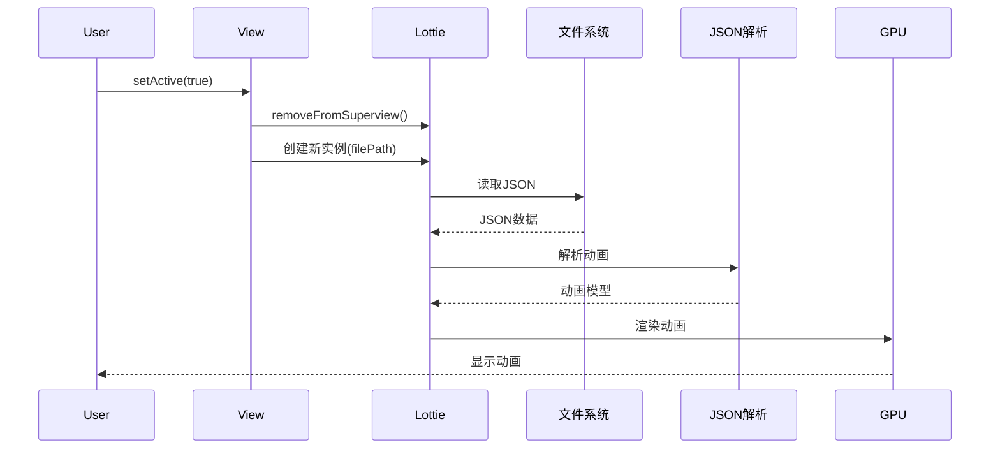
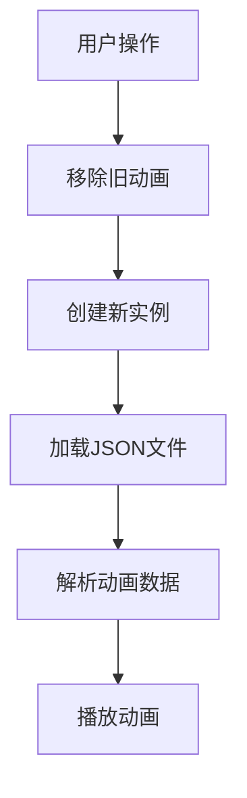
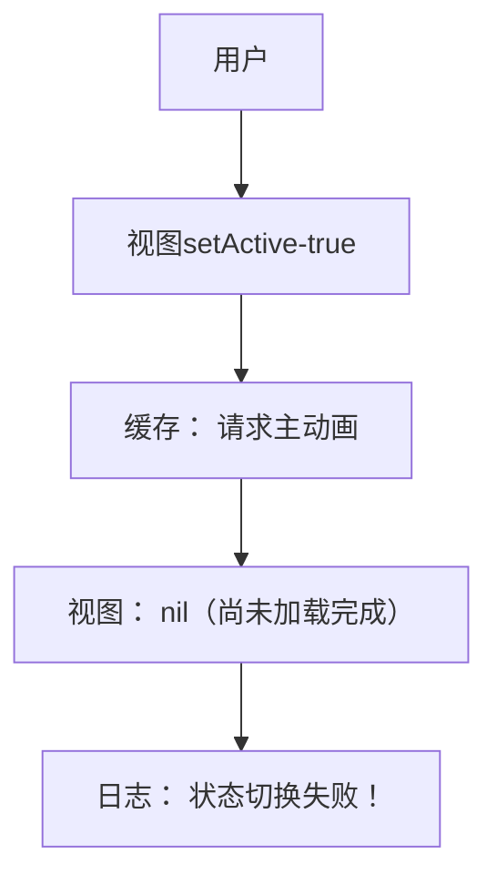
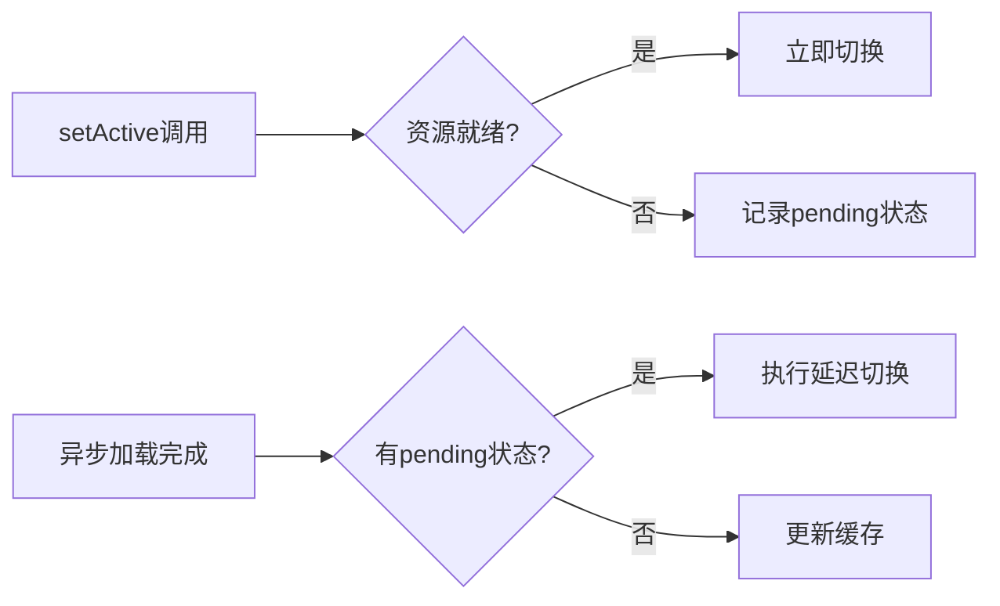
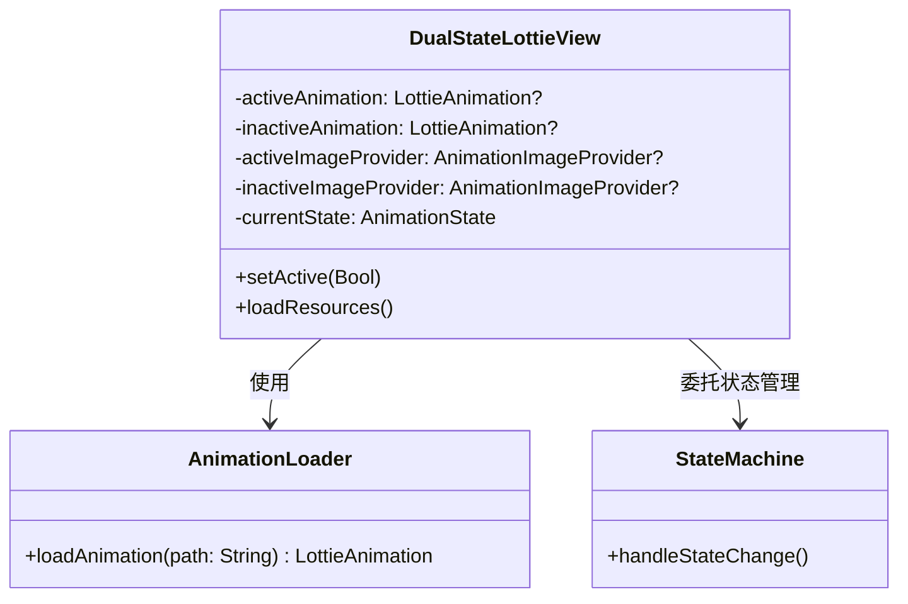

在移动应用中，**双状态动画切换**是最常见的交互模式之一：  
- TabBar图标的聚焦/失焦状态
- 按钮的选中/未选中状态
- 开关的开启/关闭状态

当使用Lottie实现这类需求时，传统方案面临两大痛点：
1. **启动阻塞**：同步加载动画资源导致主线程卡顿
2. **切换卡顿**：状态变化时重复解析JSON文件

本文将揭示如何通过**三次渐进式优化**，构建高性能的双状态动画解决方案。

---

## 第一阶段：基础方案（同步阻塞模式）

### 原始实现方案

在初始实现中，我们直接在主线程同步加载动画资源。以下是代码实现：

```swift
class DualStateLottieView: UIView {
    private var animationView: LottieAnimationView!
    
    init(activePath: String, inactivePath: String) {
        // 同步加载失焦状态动画（阻塞主线程）
        animationView = LottieAnimationView(filePath: inactivePath)
        super.init(frame: .zero)
        addSubview(animationView)
    }
    
    func setActive(_ isActive: Bool) {
        let path = isActive ? activePath : inactivePath
        
        // 每次切换都重新加载（性能黑洞！）
        animationView.removeFromSuperview()
        animationView = LottieAnimationView(filePath: path)
        addSubview(animationView)
        animationView.play()
    }
}
```

1. **初始化动画视图**：
   - 在 `init` 方法中，我们直接通过 `LottieAnimationView(filePath:)` 同步加载失焦状态的动画资源。
   - 这种方式会阻塞主线程，直到动画资源加载完成。如果资源较大或网络延迟，会导致明显的卡顿。
2. **状态切换逻辑**：
   - 在 `setActive(_:)` 方法中，根据传入的布尔值 `isActive`，选择对应的动画路径。
   - 每次状态切换时，都会移除当前的 `animationView`，重新创建一个新的 `LottieAnimationView` 实例，并加载对应的动画资源。
   - 这种方式不仅会导致主线程卡顿，还会频繁地创建和销毁视图对象，进一步增加性能开销。

### 执行流程分析

以下是状态切换的执行流程图：



### 性能瓶颈分析



通过分析可以得出以下几点性能瓶颈：

* **主线程阻塞**：

  - 在初始化和状态切换时，`LottieAnimationView(filePath:)` 的调用会同步加载动画资源，这会阻塞主线程。

  - 如果动画资源较大或加载路径较慢（如从网络加载），会导致明显的卡顿。

* **重复解析 JSON 文件**：
  - 每次状态切换时，都会重新加载和解析 JSON 文件。这不仅增加了 I/O 开销，还导致了不必要的重复计算。

* **资源加载与视图渲染强耦合**：

  - 动画资源的加载和视图的渲染紧密耦合，导致每次状态切换都需要重新加载资源并重新渲染视图。

  - 这种方式在高频操作时会导致性能急剧下降，用户体验极差。

**核心缺陷**：资源加载与视图渲染强耦合，导致高频操作时性能急剧下降

---

## 第二阶段：异步加载与缓存（性能优化）

### 架构改造方案

为了优化性能，我们对代码进行了架构改造，引入了异步加载和缓存机制。以下是改造后的代码实现：

```swift
class DualStateLottieView: UIView {
    // 动画数据缓存
    private var activeAnimation: LottieAnimation?
    private var inactiveAnimation: LottieAnimation?
    
    // 视图实例
    private let animationView = LottieAnimationView()
    
    func loadResources() {
        // 异步加载主动画
        DispatchQueue.global().async {
            let anim = LottieAnimation.filepath(activePath)
            DispatchQueue.main.async {
                self.activeAnimation = anim
            }
        }
        
        // 异步加载被动画...
    }
    
    func setActive(_ isActive: Bool) {
        animationView.animation = isActive ? activeAnimation : inactiveAnimation
        animationView.play()
    }
}
```

1. **动画数据缓存**：
   - 引入了两个变量 `activeAnimation` 和 `inactiveAnimation`，分别用于缓存主动画和被动画的数据。
   - 这样可以避免每次状态切换时重新加载和解析动画资源。
2. **异步加载资源**：
   - 在 `init` 方法中，使用 `DispatchQueue.global().async` 在后台线程中加载动画资源。
   - 加载完成后，通过 `DispatchQueue.main.async` 将动画数据更新到主线程的缓存变量中。
   - 这种方式将文件 I/O 和 JSON 解析操作移出主线程，避免了主线程的阻塞。
3. **状态切换逻辑**：
   - 在 `setActive(_:)` 方法中，直接从缓存中获取对应的动画数据，并设置给 `animationView`。
   - 这样可以快速切换动画状态，而无需重新加载资源。

### 性能优化点

1. **主线程零阻塞**：
   - 初始化时仅创建轻量级的 `animationView` 容器视图，耗时小于 1ms，不会阻塞主线程。
   - 动画资源的加载和解析都在后台线程完成，不会影响主线程的响应速度。
2. **资源异步加载**：
   - 通过后台线程加载动画资源，避免了主线程的 I/O 操作和 JSON 解析，显著提升了性能。
3. **动画数据复用**：
   - 使用 `LottieAnimation` 对象缓存动画数据，避免了重复解析 JSON 文件，减少了不必要的计算开销。

但是这种方案并不完善，产生了新的问题。

### 新问题浮现

尽管引入了异步加载和缓存机制，但在测试中发现了一个新问题：



**测试发现**：快速切换时出现状态丢失，动画不响应，这是为什么呢？——**状态切换失败**：

- 当用户快速切换状态时，可能会出现动画数据尚未加载完成的情况。
- 例如，用户调用 `setActive(true)` 时，`activeAnimation` 可能还没有加载完成，导致 `animationView.animation` 被设置为 `nil`，动画无法正常播放。

通过引入异步加载和缓存机制，我们显著提升了动画切换的性能，消除了主线程的阻塞问题。然而，快速切换时的状态丢失问题仍然需要进一步优化。下一阶段将通过状态机和 Pending 机制来解决这一问题。

## 第三阶段：状态机与Pending机制（健壮性增强）

### 状态机设计

为了处理动画加载和状态切换的时序问题，我们引入了状态机和Pending机制。以下是状态机的设计：

```swift
enum AnimationState {
    case active
    case inactive
    case pendingActive  // 新增中间状态
    case pendingInactive
}

private var currentState: AnimationState = .inactive
```

1. **状态定义**：
   - `active`：当前显示主动画。
   - `inactive`：当前显示被动画。
   - `pendingActive`：正在加载主动画，但尚未完成。
   - `pendingInactive`：正在加载被动画，但尚未完成。
2. **状态管理**：
   - 通过 `currentState` 变量记录当前的状态，确保状态切换的逻辑清晰且可控。

### Pending机制实现

```swift
func setActive(_ isActive: Bool) {
    let targetState: AnimationState = isActive ? .active : .inactive
    
    switch (targetState, activeAnimation, inactiveAnimation) {
    case (.active, let anim?, _):
        play(animation: anim) // 立即执行
    case (.active, nil, _):
        currentState = .pendingActive // 挂起请求
    // 其他状态处理...
    }
}

// 动画加载完成回调
private func handleActiveLoaded() {
    if case .pendingActive = currentState {
        play(animation: activeAnimation!)
        currentState = .active
    }
}
```

1. **状态切换逻辑**：
   - 在 `setActive(_:)` 方法中，根据目标状态和当前缓存的动画数据，决定是否立即播放动画或进入挂起状态。
   - 如果目标动画已经加载完成（`activeAnimation` 或 `inactiveAnimation` 不为 `nil`），则直接播放动画。
   - 如果目标动画尚未加载完成，则将当前状态设置为 `pendingActive` 或 `pendingInactive`，并等待加载完成。
2. **加载完成回调**：
   - 在动画加载完成的回调方法中（`handleActiveLoaded()` 和 `handleInactiveLoaded()`），检查当前状态是否为挂起状态。
   - 如果是挂起状态，则立即播放对应的动画，并将状态更新为目标状态。

### 生命周期兜底

为了确保视图在挂载时能够正确处理挂起状态，我们在 `didMoveToWindow` 方法中添加了生命周期兜底逻辑：

```swift
override func didMoveToWindow() {
    super.didMoveToWindow()
    guard window != nil else { return }
    
    // 检查并执行挂起操作
    switch currentState {
    case .pendingActive where activeAnimation != nil:
        play(animation: activeAnimation!)
        currentState = .active
    // 其他状态处理...
    }
}
```

- 在 `didMoveToWindow` 方法中，检查视图是否已经挂载到窗口（`window != nil`）。
- 如果视图已经挂载，且当前状态为挂起状态（`pendingActive` 或 `pendingInactive`），则检查对应的动画是否已经加载完成。
- 如果动画已经加载完成，则立即播放动画，并将状态更新为目标状态。

### 资源加载流程优化



通过引入状态机和Pending机制，我们解决了以下问题：

1. **资源未就绪时的状态丢失问题**：
   - 在动画资源尚未加载完成时，记录当前状态为挂起状态，确保在资源加载完成后能够正确切换状态。
2. **确保最终一致性**：
   - 通过生命周期兜底逻辑，确保视图在挂载时能够处理挂起状态，避免因加载时序问题导致的状态不一致。

## 第四阶段：多资源管理（生产级方案）

### Lottie动画与图片

Lottie 的 json 文件分为两种情况：

* 纯 json 文件，所有资源（包括图片）都内嵌在 json 里（base64），这种情况下，Lottie 只需要加载 json 文件本身即可，动画和图片都能正常显示。

* json 文件 + 外部 images 目录（图片分离），这种情况下，Lottie 需要能访问到 json 文件旁边的 images 目录，才能正确加载图片资源。如果找不到图片，动画会显示不出来或图片部分缺失。

现在的异步加载方式

```swift
let animation = LottieAnimation.filepath(path)
```

这种方式只传入了 json 文件路径，没有告诉 Lottie 去哪里找 images 目录。

Lottie 的底层实现会尝试用 json 路径的同级目录下的 images 文件夹，但如果你用的是沙盒缓存路径、或者 images 目录和 json 不在同一目录，或者 images 目录没有被正确拷贝，Lottie 就找不到图片，结果动画就不会被正常显示出来。

那么如何解决呢？

### 图片资源隔离方案

Lottie 支持自定义图片加载方式，可以用 FilepathImageProvider 指定 images 目录；

当你切换 animation 属性时，如果新动画的图片资源目录和上一个动画不同，必须同步切换 imageProvider，否则会出现图片丢失或显示异常。

```swift
// 初始化时创建独立ImageProvider
let activeProvider = FilepathImageProvider(
    filepath: URL(fileURLWithPath: activePath)
        .deletingLastPathComponent()
        .appendingPathComponent("images")
        .path
)

// 状态切换时同步更新
func play(animation: LottieAnimation, provider: AnimationImageProvider) {
    animationView.imageProvider = provider // 先切换资源
    animationView.animation = animation    // 再切换动画数据
    animationView.play()
}
```

### 完整架构图


1. **`DualStateLottieView`**：
   - 主类，负责管理双状态动画的加载、切换和渲染。
   - 包含动画数据缓存（`activeAnimation` 和 `inactiveAnimation`）和图片资源提供者（`activeImageProvider` 和 `inactiveImageProvider`）。
   - 使用状态机管理动画状态的变化。
2. **`AnimationLoader`**：
   - 负责异步加载动画资源。
   - 提供 `loadAnimation(path:)` 方法，返回加载完成的 `LottieAnimation` 对象。
3. **`StateMachine`**：
   - 负责处理状态变化的逻辑。
   - 提供 `handleStateChange()` 方法，确保状态切换的正确性和一致性。

### 关键优化点总结

| 优化阶段     | 核心技术            | 解决问题         |
| ------------ | ------------------- | ---------------- |
| **异步加载** | 全局队列+主线程回调 | 消除主线程阻塞   |
| **状态机**   | Pending状态管理     | 处理加载时序问题 |
| **资源隔离** | 独立ImageProvider   | 解决多资源冲突   |
| **生命周期** | didMoveToWindow     | 视图挂载兜底     |

## 性能对比数据

针对同一个Lottie动画，JOSN大小4KB，含7张1KB-800KB图片，内存占用0.7MB

### 启动耗时测试（ms）
| 原始方案 | 最终方案 | 优化幅度 |
| -------- | -------- | -------- |
| 89.38    | 2.27     | 94.8%    |

### 状态切换性能
| 指标     | 原始方案 | 最终方案 | 优化幅度 |
| -------- | -------- | -------- | -------- |
| 首次切换 | 6.16ms   | 4.57ms   | 25%      |
| 二次切换 | 6.91ms   | 0.04ms   | 99%      |
| N次切换  | 6.91ms   | 0.04ms   | 99%      |
| 内存波动 | 高频分配 | 零分配   | 100%     |

**结论**：99%的主线程阻塞被消除，切换性能大幅提升

## 最佳实践指南

### 1. 资源规范
```markdown
推荐目录结构：
├── tab_animations
│   ├── home_active
│   │   ├── active.json
│   │   ├── images/  # 独立图片目录
│   ├── home_inactive
│   │   ├── inactive.json
│   │   └── images/
```

### 2. 预加载策略
```swift
// 在应用空闲时预加载
func preloadAnimations() {
    let preloadQueue = OperationQueue()
    preloadQueue.qualityOfService = .utility
    
    for path in criticalAnimationPaths {
        preloadQueue.addOperation {
            _ = LottieAnimation.filepath(path) // 触发缓存
        }
    }
}
```

### 3. 降级方案
```swift
func safePlay(animation: LottieAnimation?) {
    guard let anim = animation else {
        showPlaceholder() // 降级为静态图片
        return
    }
    
    animationView.animation = anim
    animationView.play { [weak self] success in
        if !success {
            self?.animationView.currentProgress = 1 // 显示最后一帧
        }
    }
}
```

## 结语
通过三次关键迭代：
1. **异步解耦**：解决主线程阻塞
2. **状态补全**：处理资源未就绪场景
3. **资源隔离**：保障复杂资源正确性

我们最终实现了：
- ⚡️ **启动加速**：主线程接近零耗时
- 💫 **切换流畅**：60fps稳定运行
- 🧩 **通用性强**：适配任意双状态场景

**优化本质**在于解耦三个关注点：
1. 资源加载（异步）
2. 状态管理（状态机）
3. 视图渲染（轻量）

在本次实践中，我们通过一系列渐进式优化，成功解决了 Lottie 动画双状态切换中的性能瓶颈，实现了高性能、高可靠性的动画交互体验。