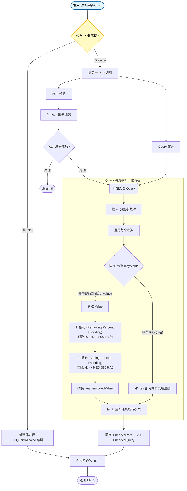

这份文档总结了在 iOS 开发中处理不规范 URL 字符串（包含中文、特殊符号或混合编码）的完整技术方案。该方案重点解决了**低版本 iOS 系统对 URL 格式要求严格导致初始化失败**的问题，并纠正了常见的处理误区。

## 1. 问题背景

在 iOS 开发中，将字符串转换为 URL 对象时存在版本差异：

- **高版本系统 (iOS 17+)**：系统 API 变得宽容，URL(string:) 和 URLComponents 会自动尝试修正未编码的字符（如中文）。
- **低版本系统**：遵循 RFC 3986 标准，极为严格。如果字符串中包含未编码的中文、空格或特殊符号（如 {}），URL(string:) 和 URLComponents(string:) 会直接返回 nil。

**常见痛点**：

1. 后端下发的 URL 可能包含未编码的中文参数。
2. 参数可能混合了“已编码”和“未编码”的情况（例如：city=%E5%8C%97%E4%BA%AC&name=张三）。
3. 无法简单通过 guard var components = URLComponents 进入处理逻辑，因为该初始化本身就会失败。

## 2. 核心原则

为了兼容所有版本并处理各种脏数据，必须遵循以下原则：

1. **兜底策略**：优先尝试系统标准解析，失败后回退到手动字符串解析。
2. **归一化处理（Reset & Re-encode）**：不对参数进行“是否已编码”的判断，而是对所有 Value 执行 **“先解码，后编码”** 的操作。这能同时解决未编码字符和避免二次编码（Double Encoding）。
3. **严禁整体解码**：绝对不能对整个 URL 字符串进行解码后再编码，必须**先拆分出 Key/Value，仅对 Value 进行处理**。

## 3. 完整解决方案逻辑

### 步骤流程图

1. **尝试标准初始化**：调用 URLComponents(string: self)。**成功**：说明字符串结构合法（或系统版本高自动处理了）。为了保险，可对 query 再做一次归一化，然后返回。**失败 (nil)**：进入手动清洗流程（低版本常见情况）。
2. **手动拆解（Fallback）**：根据第一个 ? 将字符串切分为 **Path** 和 **Query**。对 **Path** 部分进行单独编码（防止路径中有中文）。
3. **参数清洗（核心）**：将 Query 字符串按 & 分割成键值对。将每个键值对按第一个 = 分割成 Key 和 Value。对 **Value** 进行 **归一化**：Value -> Decode -> Encode。
4. **重组**：将编码后的 Path 和清洗后的 Query 拼接，生成最终 URL。

## 4. 代码实现 (Swift)

将此扩展添加到你的项目中即可直接使用。

```swift
import Foundation

extension String {
    /// 将包含中文、特殊符号或混合编码的字符串转换为安全的 URL
    /// 兼容低版本 iOS，能够自动处理未编码的参数，避免 nil
    func toSafeURL() -> URL? {
        // 1. 尝试标准解析 (高版本 iOS 或 标准 URL 会走这里)
				if let directURL = URL(string: self) {
            return directURL
        }
        
        // 2. 标准解析失败 (低版本 iOS 遇中文通常走这里)
        // 说明字符串结构不符合 RFC 标准，需要手动“手术”
        return manualFixMalformedString(self)
    }
    
    /// 手动解析并修复结构损坏的 URL 字符串
    private func manualFixMalformedString(_ str: String) -> URL? {
        // 寻找第一个 "?" 来分割 path 和 query
        guard let range = str.range(of: "?") else {
            // 没有问号，说明只有 Path，直接对 Path 编码
            let encoded = str.addingPercentEncoding(withAllowedCharacters: .urlQueryAllowed) ?? str
            return URL(string: encoded)
        }
        
        // 切割字符串
        let pathPart = String(str[..<range.lowerBound])
        let queryPart = String(str[range.upperBound...])
        
        // 1. 编码 Path 部分 (防止 Path 中包含中文)
        // 注意：这里对 Path 使用 urlQueryAllowed 是一种宽松做法，通常够用
        guard let encodedPath = pathPart.addingPercentEncoding(withAllowedCharacters: .urlQueryAllowed) else 				 {
            return nil
        }
        
        // 2. 编码 Query 部分 (核心逻辑)
        let encodedQuery = encodeQueryValues(queryPart)
        
        // 3. 重新组装
        let finalString = "\(encodedPath)?\(encodedQuery)"
        
        return URL(string: finalString)
    }
    
    /// 核心方法：解析参数并进行“归一化”编码
    private func encodeQueryValues(_ query: String) -> String {
        // 按 & 分割参数对
        let pairs = query.components(separatedBy: "&")
        var encodedPairs: [String] = []
        
        for pair in pairs {
            // 按 = 分割 Key 和 Value
            // maxSplits: 1 非常重要！防止 Value 中包含的 "=" 被错误截断
            let kv = pair.split(separator: "=", maxSplits: 1, omittingEmptySubsequences: false)
            
            if kv.count == 2 {
                let key = String(kv[0])
                let rawValue = String(kv[1])
                
                // --- 归一化处理 (Reset & Re-encode) ---
                // 1. 先解码 (Removing Percent Encoding): 
                //    将 "%E5%BC%A0" 还原为 "张"，将 "张" 保持为 "张"
                let decodedValue = rawValue.removingPercentEncoding ?? rawValue
                
                // 2. 后编码 (Adding Percent Encoding):
                //    将所有内容统一编码为标准格式
                //    使用 .urlQueryAllowed 集合，它允许保留字母数字，但会编码中文和特殊符
                let encodedValue = decodedValue.addingPercentEncoding(withAllowedCharacters: .urlQueryAllowed) ?? decodedValue
                
                encodedPairs.append("\(key)=\(encodedValue)")
            } else {
                // 处理异常情况（如只有 key 没有 value: "id=" 或 "flag"）
                let rawContent = String(kv[0])
                let decoded = rawContent.removingPercentEncoding ?? rawContent
                let encoded = decoded.addingPercentEncoding(withAllowedCharacters: .urlQueryAllowed) ?? decoded
                encodedPairs.append(encoded)
            }
        }
        
        return encodedPairs.joined(separator: "&")
    }
}
```

下面通过流程图详细解释



### 步骤说明

1. **分支判断 (?)**：这是处理的第一步。如果没有问号，视为纯路径，直接简单处理。如果有问号，必须物理切割，防止 Query 中的 & 或 = 干扰 Path 解析，反之亦然。
2. **Path 独立编码**：Path 部分（https://host/path/中文）也需要编码，否则 URL 初始化依然会失败。**注意**：Path 处理完如果失败（极其罕见），直接返回 nil。
3. **Query 清洗（红色虚线框部分）**：这是整个方案的灵魂。**分割**：先用 & 拆，再用 = 拆（maxSplits: 1 保证 Value 里的 = 不会被误切）。**归一化 (Reset & Re-encode)**：**解码**：把可能存在的乱码（%25）或已编码字符还原成原始字符。**编码**：统一穿上“标准制服”，确保输出是合法的 URL 编码。这一步确保了无论输入是“中文”、“已编码中文”还是“混合体”，输出都是统一且正确的。
4. **重组**：最后将干净的 Path 和干净的 Query 拼在一起，生成最终的 URL 对象。

## 5. 常见疑难解答 (Q&A)

### Q1: 为什么不能判断“是否有中文”再编码？

**A:** 逻辑太复杂且不可靠。除了中文，还有空格、{}、^ 等符号需要处理。而且如果一个参数部分是中文，部分是编码过的（混合状态），判断逻辑极难编写。**“先全解再全编”** 是成本最低且最稳健的方式。

### Q2: 为什么要先 Decode 再 Encode？

**A:** 为了防止**二次编码（Double Encoding）**。

- 输入: city=%E5%8C%97%E4%BA%AC (已经是北京的编码)
- 如果不解码直接编码 -> city=%25E5%258C... (变成乱码)
- 如果先解码(北京) 再编码 -> city=%E5%8C%97%E4%BA%AC (正确)

### Q3: 为什么不能对整个 URL 字符串先 Decode 再 Encode？

**A:** 这是一个致命错误，会破坏 URL 的结构。

- 场景：URL 参数中嵌套了另一个 URL（如回调地址）。
- 原始值：callback=https%3A%2F%2Fb.com%2F%3Fid%3D1%26user%3D2 (这里面的 & 和 = 被编码了，是安全的)。
- 如果整体 Decode：变成 callback=https://b.com/?id=1&user=2。
- 此时，user=2 会被错误地识别为外层 URL 的参数，导致 callback 参数被截断，逻辑出错。
- **结论**：必须先按 & 和 = 拆分出独立的 Value，确保 Decode 操作只发生在 Value 内部。

### Q4: URLComponents 在低版本返回 nil 是 bug 吗？

**A:** 不是 bug，是特性。RFC 3986 标准规定 URL 只能包含 ASCII 字符。低版本系统严格遵守了这一标准，检测到非法字符拒绝解析；高版本系统只是增加了自动容错机制。

## 6. 使用示例

```swift
// 模拟一个极其恶劣的 URL 字符串
// 包含：中文、空格、JSON、已编码字符、嵌套 URL
let badURL = "https://api.com/path?name=张 三&city=%E5%8C%97%E4%BA%AC&json={\"id\":1}&callback=https%3A%2F%2Fb.com"

// 1. 直接转换（低版本必挂）
let url1 = URL(string: badURL) 
// Result: nil

// 2. 使用安全转换方案
let safeURL = badURL.toSafeURL()
// Result: Optional(https://api.com/path?name=%E5%BC%A0%20%E4%B8%89&city=%E5%8C%97%E4%BA%AC&json=%7B%22id%22:1%7D&callback=https%3A%2F%2Fb.com)

// 验证结果：
// name=张 三       -> 正确编码
// city=%E5...     -> 保持原样（未被二次编码）
// json={"id":1}   -> 正确编码
// callback=...    -> 保持原样（未被破坏结构）
```